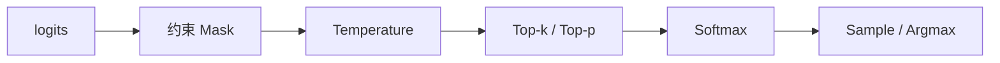

同一套权重，换一组采样参数，输出风格可以天差地别；换一种解码算法，延迟与吞吐也会跟着变。生产服务里，采样不是"调手感的小旋钮"，而是**质量—多样性—成本**的控制面。这一节把 Temperature / Top-p / Top-k、Logprobs、并行采样与 Beam Search 讲清楚，并落到工程影响。

<!-- more -->

## 📑 目录

- [1. 从 logits 到 Token：采样管线](#1-从-logits-到-token采样管线)
- [2. Temperature、Top-p、Top-k](#2-temperaturetop-ptop-k)
- [3. Logprobs：把不确定性暴露出来](#3-logprobs把不确定性暴露出来)
- [4. 并行采样与 Best-of-N](#4-并行采样与-best-of-n)
- [5. Beam Search：何时还值得用](#5-beam-search何时还值得用)
- [6. 生产参数建议与性能影响](#6-生产参数建议与性能影响)
- [7. 与其它特性的交互](#7-与其它特性的交互)
- [总结](#-总结)
- [自我检验清单](#-自我检验清单)
- [参考资料](#-参考资料)

---

## 1. 从 logits 到 Token：采样管线

每一步 Decode，模型输出词表维 logits，典型管线：

1. （可选）约束 mask（结构化输出）
2. Temperature 缩放
3. Top-k / Top-p 截断
4. Softmax 得概率
5. 采样（或取 argmax）
6. （可选）记录 logprob / top logprobs

🔑 **核心概念**：`temperature=0`（或等价贪婪）走确定性路径；`temperature>0` 才进入随机采样。线上排障时先确认是否在比"不可复现"的采样结果。

---

## 2. Temperature、Top-p、Top-k

| 参数 | 作用 | 调高 | 调低 |
|---|---|---|---|
| Temperature $T$ | 缩放 logits，改变分布尖锐度 | 更随机、更有创意 | 更保守、更稳定 |
| Top-k | 只保留概率最高的 $k$ 个 Token | 候选更多 | 更聚焦头部 |
| Top-p（Nucleus） | 保留累积概率达 $p$ 的最小集合 | 尾部更开放 | 截断更狠 |

直观公式（Temperature）：

$$
p_i = \frac{\exp(z_i / T)}{\sum_j \exp(z_j / T)}
$$

实践组合：

- **事实问答 / 工具参数**：$T \in [0, 0.3]$，可配较低 Top-p
- **写作 / 头脑风暴**：$T \in [0.7, 1.0]$，Top-p 0.9～0.95
- **Top-k 与 Top-p 同时开**：以引擎语义为准，通常取交集；不要无脑叠到极端

📌 **关键点**：采样参数不提升模型知识上限，只改变**在已有分布上怎么走**。胡编乱造有时是 $T$ 过高，有时是模型本身不会——要用评测集区分。

⚠️ **注意**：结构化输出场景下，合法集可能很小；过高 $T$ 会在合法集内剧烈抖动，出现怪异但合法的字段值。

---

## 3. Logprobs：把不确定性暴露出来

Logprobs 返回所选 Token（及可选 Top-N）的对数概率，用途：

- **置信度代理**：连续低 logprob 可能表示模型在"硬猜"
- **检索/路由**：对候选答案打分
- **数据沉淀**：挖掘高不确定样本做微调
- **调试提示词**：看模型在关键位置是否摇摆

成本：

- 要维护额外 Top-N 候选，带宽与序列化开销上升
- 流式场景下包体变大
- 不是真置信度校准；跨模型不可直接比绝对值

💡 **提示**：生产默认关闭或仅对内部调试租户开启 `logprobs`。需要打分时，优先对短答案或关键字段开，而不是全量长生成。

---

## 4. 并行采样与 Best-of-N

参数 `n>1`（并行采样）让引擎为同一 Prompt 生成多条独立样本。常见用法：

- **Best-of-N**：用奖励模型 / 规则 / 自洽投票挑最好一条
- **多样性返回**：产品直接展示多个候选
- **评测**：估计输出方差

与 PagedAttention 的关系（第 2 章）：多条样本共享 Prompt 前缀 KV，Decode 分叉后 Copy-on-Write，显存与算力仍近似按分支数增长。

| 📊 代价维度 | 影响 |
|---|---|
| 算力 | Decode 约 ×N（前缀可共享） |
| 显存 | 分叉后 KV ×N |
| 延迟 | 端到端往往接近最慢那条；服务队列压力↑ |
| 计费 | 输出 Token 通常按 N 条合计 |

---

## 5. Beam Search：何时还值得用

Beam Search 维护 $B$ 条候选前缀，每步扩展后保留总分最高的 $B$ 条。相对随机采样：

- ✅ 更适合**短、追求精确匹配**的任务（某些翻译、结构化短序列）
- ❌ 对开放域长文本常更"平庸"，且实现与 Continuous Batching 不友好
- ❌ 成本随 beam width 上升，线上 LLM 服务已较少作为默认

现代 LLM 服务更常见的是：**低 T 采样 / 贪婪 + 后验 Best-of-N**，而不是大宽度 Beam。若框架仍暴露 Beam 接口，先用小规模评测确认收益，再决定是否放进热路径。

---

## 6. 生产参数建议与性能影响

| 场景 | 建议起点 | 性能备注 |
|---|---|---|
| 分类/抽取/工具参数 | T=0～0.2，必要时结构化约束 | 延迟稳，易回归 |
| 客服助手 | T=0.3～0.7，Top-p≈0.9 | 平衡多样性与稳 |
| 创意生成 | T=0.8～1.1 | 注意安全过滤 |
| 需要可复现评测 | 固定 seed + T=0 | A/B 才可比 |
| Best-of-N | N=4～8 起步 | 独立看 QPS 与 KV |

性能相关结论：

- 采样参数本身对单步 Kernel 时间影响通常小于**是否开 logprobs / n / beam**
- `n` 与 beam 会成倍放大 Decode 与 KV，是容量规划的一等公民
- 与 Speculative Decoding 等技术组合时，验证接受率与质量，不要假设"参数默认值放之四海皆准"

📌 **关键点**：把采样配置当成**产品配置**纳入版本管理与回归，而不是各环境手改。

---

## 7. 与其它特性的交互

| 特性 | 交互要点 |
|---|---|
| 结构化输出 | 先 mask 再采样；合法集小时宜降低 T |
| Speculative Decoding | 采样随机性影响草稿接受率，需一起回归 |
| 并行采样 `n` | 与 Prefix Cache / CoW 友好，但仍耗 KV |
| 多 LoRA | 不同 Adapter 对同一 T 的"手感"不同，勿共用一套拍脑袋参数 |
| 评测门禁 | 性能对比固定 T=0 或固定种子，质量对比另开采样矩阵 |

一句话：**采样参数是产品语义的一部分**，改它等于改行为，必须进变更评审。

---

## 📝 总结

- 采样管线在 logits 之后依次做约束、温度缩放、截断与采样。
- Temperature / Top-p / Top-k 控制随机性与候选集，不增加知识。
- Logprobs 利于打分与调试，但有带宽与误用风险。
- 并行采样支持 Best-of-N，前缀可共享，分叉后成本近线性上升。
- Beam Search 在现代开放域 LLM 在线服务中已非默认首选。
- 生产应将采样配置纳入版本与评测，并单独评估 `n`/logprobs 的容量影响。
- 与结构化输出、投机解码等组合时要联合回归。

## 🎯 自我检验清单

- 能画出从 logits 到 Token 的采样管线
- 能解释 Temperature 对分布尖锐度的影响
- 能对比 Top-k 与 Top-p 的截断方式
- 能说出 Logprobs 的用途与局限
- 能估算 `n=8` 对 KV 与吞吐的大致影响
- 能判断何时用贪婪/低 T，何时用 Best-of-N 而不是 Beam

## 📚 参考资料

- [vLLM — Sampling Parameters](https://docs.vllm.ai/en/latest/dev/sampling_params.html)
- [Holtzman et al., The Curious Case of Neural Text Degeneration (Top-p)](https://arxiv.org/abs/1904.09751)
- [OpenAI API — Create chat completion（temperature / top_p / n / logprobs）](https://platform.openai.com/docs/api-reference/chat/create)
