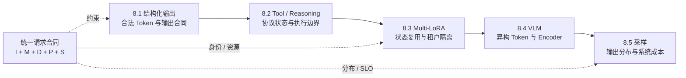

## 📑 本章导航
- [1. 本章定位](#1-本章定位)
- [2. 统一请求合同](#2-统一请求合同)
- [3. 一张知识图看完本章](#3-一张知识图看完本章)
- [4. 贯穿五节的 Agent 请求](#4-贯穿五节的-agent-请求)
- [5. 从合同进入运行时](#5-从合同进入运行时)
- [6. 五节边界与跨章分工](#6-五节边界与跨章分工)
- [7. 阅读时始终追问的六件事](#7-阅读时始终追问的六件事)
- [8. 失败与降级不变量](#8-失败与降级不变量)
- [9. 学完应具备的能力](#9-学完应具备的能力)
- [总结](#总结)
- [自我检验](#自我检验)
- [论文与资料](#论文与资料)

---

## 1. 本章定位
模型服务除了“跑得快、装得下”，还必须回答五个生产问题：输出是否遵守合同，请求究竟使用哪个模型与 Adapter，多模态输入如何进入计算图，采样是否保持约定语义，以及一个租户能否挤占他人的资源。

第 5 章已经用投机解码说明：优化不能破坏目标分布；第 7 章已经用 P/D 解耦说明：局部吞吐必须服从端到端 SLO。本章把这两条约束带进可编程模型服务，讨论**请求语义怎样成为运行时状态与资源成本**。

这里的“生产级”不是接口字段很多，也不是某个引擎宣称支持某项功能，而是系统在组合请求、并发、缓存命中、资源不足和失败恢复时，仍能守住同一份可验证合同。

> 本章目标：从一份请求合同推导状态、批次、缓存、显存、CPU/GPU 边界与降级语义，而不是背 API 功能清单。

## 2. 统一请求合同
把一次生成请求抽象为：
$$
\mathcal{R}=(I,M,D,P,S)
$$
- $I$（Input）：规范化后的文本，以及可选图片、音频或视频的类型、顺序与占位关系；
- $M$（Model identity）：底座模型、revision、Tokenizer/Template，以及租户 Adapter 的名称和版本；
- $D$（Decoding constraints）：输出语法、Tool/Reasoning 协议、停止条件与业务可校验的结构边界；
- $P$（Sampling policy）：Logit 变换顺序、确定或随机选择、随机数状态、候选分支与概率观测；
- $S$（SLO）：TTFT、TPOT、端到端时限、优先级、配额与资源隔离要求。

生产成功不是“返回了一段文本”，而是多个条件同时成立：
$$
\mathrm{Success}(\mathcal R)=
\mathrm{ValidOutput}\land\mathrm{SamplingCorrect}\land\mathrm{ExactIdentity}\land\mathrm{Isolation}\land\mathrm{SLOMet}
$$
语法合法仍可能业务错误；工具意图合法仍未经授权；平均延迟达标也不能掩盖某个租户的 P99 失控。

### 2.1 五类字段怎样进入系统
- **运行时状态**：Grammar 状态、Parser 阶段、Adapter 驻留、Encoder 输出、KV block、RNG 与截止时间都随合同推进；
- **批次兼容性**：两个请求能否安全且高效地共批，取决于 Kernel 支持、状态形状、Adapter/模态组合和预算，而不只是序列长度；
- **缓存身份**：任何会改变被缓存数值的输入、模型、Adapter 或预处理版本都必须进入 key，否则“命中”会复用错误状态。

这不表示五类字段必须机械地塞进同一个 KV key。采样策略和 SLO 通常不改变已有 Prompt KV 的数值，却必须保留在采样器与调度器状态中；正确原则是：**影响值的字段进入缓存身份，影响执行的字段进入请求与批次身份**。

## 3. 一张知识图看完本章

学习顺序从“哪些输出可提交”走向“谁的状态参与生成”，再补齐异构输入和概率语义。五节不是五项孤立功能：前一节建立的身份或状态，都会成为后一节的兼容性与成本条件。

## 4. 贯穿五节的 Agent 请求
后续统一追踪一个 AI Infra 值班 Agent，不在每节更换案例：
- **输入**：文本要求检查 `gpu-prod`，并可选附带一张监控截图；
- **模型身份**：固定底座 revision，租户 `ops-a` 使用 `ops-diagnosis@17` LoRA；
- **工具阶段**：模型只能提出 `get_cluster_status` 意图，参数受结构约束，应用授权后才执行；
- **最终阶段**：工具结果回填后，模型必须生成固定结构的 JSON 结论，字段还要经过业务校验；
- **采样策略**：事故判定使用近确定策略，解释草稿可使用受控随机策略，两者都明确复现边界；
- **SLO 与隔离**：约束 TTFT、TPOT 和端到端时限，并向该租户计入媒体、Adapter、KV 与候选分支成本。

一次 Agent trace 至少包含 tool-plan 与 final 两次模型请求；它们共享业务上下文，却拥有不同的运行时请求身份。工具执行还需要独立的幂等身份，不能把“模型 request id”误当成“副作用只执行一次”的证明。

8.1 检查工具参数和 final JSON 的合法 Token；8.2 解释意图、Parser 与执行边界；8.3 追踪租户 LoRA；8.4 加入可选截图；8.5 比较确定与随机采样，并核算分支、概率返回和 SLO 成本。

## 5. 从合同进入运行时
1. **入口与准入（CPU）**：认证租户，固定模型与 Adapter revision，规范化输入，校验合同是否受支持，并预估资源；
2. **媒体处理（CPU → GPU）**：获取、解码和规范化媒体，再由 Encoder 产生语言模型可消费的表示；
3. **状态准备（CPU / HBM）**：查询缓存、获取 Adapter 引用、编译或命中 Grammar，并为失败回滚登记所有权；
4. **调度组批（CPU）**：按 Token、Encoder、Adapter、分支和截止时间预算判断兼容性，而不是把所有请求无条件拼在一起；
5. **生成（GPU + 采样边界）**：底座与 Adapter 产生 Logits，约束和 Logit processor 改变有效候选集，采样器按 $P$ 提交 Token；
6. **协议与回收（CPU）**：Parser 形成工具意图或 final，应用做授权与业务校验；完成、取消或超时后释放 KV、Encoder、Grammar 和 Adapter 引用。

约束计算与采样究竟落在 CPU 还是 GPU 是实现选择，但跨设备同步、mask 搬运和 Host 停顿都会进入关键路径。初学者应先画清数据与所有权，再讨论某个 Kernel 名称。

## 6. 五节边界与跨章分工
第 8 章负责可迁移的通用理论；第 12.5 节只把 Grammar、Tool 与 Agent 状态映射到固定版本 SGLang，不重复证明本章结论。本章也不以 CLI、接口字段、部署步骤或模型支持列表代替机制。

### [8.1 结构化输出：从提示词约定到受约束解码](/AIInfraGuide/inference/模块四-推理优化/第8章-生产级服务特性/81-结构化输出)
承诺：从约束语言与增量 Detokenizer 的联合状态推导合法 Token 集、Mask、编译缓存与无合法后继的失败语义。
边界：只保证可形式化的输出合同；不保证事实、权限或业务正确，也不提前讲 Tool 闭环。
### [8.2 Tool Calling 与 Reasoning Parser：把模型输出接入可执行世界](/AIInfraGuide/inference/模块四-推理优化/第8章-生产级服务特性/82-tool-calling与reasoning-parser)
承诺：划清 Template、模型 Token、Tool/Reasoning Parser、授权器与 Executor 的协议和信任边界。
边界：复用 8.1 的结构约束，不重讲 Grammar；模型只提出意图，工具副作用属于应用事务。
### [8.3 Multi-LoRA 服务：一套底座如何服务多个 Adapter](/AIInfraGuide/inference/模块四-推理优化/第8章-生产级服务特性/83-multi-lora服务)
承诺：用低秩增量解释底座复用、Adapter identity、CPU/GPU 驻留、批次碎片、槽位和租户隔离。
边界：不把动态加载说成零成本，也不允许跨 Adapter 复用未经证明等价的 KV 状态。
### [8.4 多模态推理（VLM）：Encoder、Cache 与显存链路](/AIInfraGuide/inference/模块四-推理优化/第8章-生产级服务特性/84-多模态推理vlm)
承诺：追踪媒体规范化、异构 Token、Processor/Encoder、缓存身份、CPU/GPU 流水线和显存峰值。
边界：不罗列模型名单，不把“图片张数”当作统一成本，也不重复语言采样理论。

### [8.5 采样与解码算法：从 Logits 到下一个 Token](/AIInfraGuide/inference/模块四-推理优化/第8章-生产级服务特性/85-采样与解码算法)
承诺：定义概率变换顺序、Greedy/随机语义、复现条件、分支搜索、概率观测及其 KV 和调度成本。
边界：约束解码只改变可采样支持集；best-of/Beam 只有在排名语义允许时才能提前终止，本节不重讲 Grammar、Parser、Adapter 或 Encoder。

## 7. 阅读时始终追问的六件事
1. **正确性合同**：保证的是语法、协议、业务规则、目标分布还是可复现性；验证者是谁？
2. **Batch 兼容**：状态、形状与 Kernel 是否允许共批；即使能共批，碎片和同步是否让 Goodput 下降？
3. **缓存 / Adapter identity**：哪些 revision、Template、预处理和租户状态影响缓存值；引用与淘汰由谁负责？
4. **显存账本**：权重、Adapter、KV、Encoder 特征、Grammar workspace 和候选分支各占多少，峰值何时出现？
5. **CPU/GPU 边界**：下载、预处理、编译、调度、Mask、采样和 Parser 在哪里执行，哪次同步落在关键路径？
6. **失败 / 降级**：资源不足、状态缺失、解析失败或超时时，系统拒绝、排队、重试还是降级；语义是否被静默改变？

## 8. 失败与降级不变量
- 合同不支持时应在准入阶段显式拒绝；不能先占用 GPU，再悄悄退化为无约束文本；
- Grammar 编译失败或合法集合为空时，应报告合同失败；“放开 Mask 继续生成”会破坏输出正确性；
- Adapter 缺失、版本不符或槽位不足时，只能加载、排队、拒绝或执行事先声明的回退；不能静默改用底座；
- 媒体获取或 Encoder 失败时，文本降级必须得到合同允许；缓存 key 还要包含规范化和 Encoder 身份；
- 显存或队列过载时，可做准入、配额与可协商降级，但不能让大媒体、多分支或高 rank 请求侵占其他租户保证；
- 取消、超时和重试必须释放状态引用；已经触发的工具副作用则依靠幂等键与事务处理，不能靠模型重采样“撤销”。

降级本身也是合同：改变 Adapter、模态、约束或采样策略，就等于执行了另一个请求，必须可见、可观测、可审计。

## 9. 学完应具备的能力
- 能用 $(I,M,D,P,S)$ 描述一条组合请求，而不是逐项背功能参数；
- 能区分格式合法、协议正确、业务正确和工具执行安全；
- 能判断两个请求在语义上、Kernel 上和资源上是否适合共批；
- 能为 Prefix KV、Encoder 结果和 Adapter 写出必要的身份字段；
- 能画出媒体、Grammar、采样和 Parser 的 CPU/GPU 数据流与状态所有者；
- 能估算 Adapter、Encoder、候选分支与概率观测对显存和尾延迟的放大；
- 能设计显式失败、可协商降级、租户配额和端到端 SLO 验证。

## 总结
生产级模型服务把输入、模型身份、解码约束、采样策略和 SLO 组合成一份不可静默篡改的请求合同。
8.1—8.5 分别展开输出、协议、Adapter、模态和概率，但最终都要回到同一组状态、批次、缓存、资源与失败问题。

## 自我检验
- [ ] 为什么“接口兼容”不能证明输出行为或模型能力一致？
- [ ] 哪些合同字段必须进入 Prefix KV 或 Encoder Cache key，哪些只需进入运行时状态？
- [ ] 不同 Grammar 或 Adapter 的请求是否一定不能共批？判断条件是什么？
- [ ] 为什么固定 seed 仍不足以无条件承诺跨版本、跨硬件逐 Token 一致？
- [ ] 一张图片会在哪些 CPU、GPU、缓存和 SLO 账本中留下成本？
- [ ] Adapter miss 时静默回退到底座为什么属于正确性故障？
- [ ] 工具调用成功但 final JSON 超时，这条 Agent 请求是否满足端到端合同？
- [ ] 系统降级了模态、约束或采样策略时，用户和观测系统应看到什么？

## 论文与资料
- Willard & Louf, [Efficient Guided Generation for Large Language Models](https://arxiv.org/abs/2307.09702), 2023.
- Schick et al., [Toolformer: Language Models Can Teach Themselves to Use Tools](https://arxiv.org/abs/2302.04761), NeurIPS 2023.
- Hu et al., [LoRA: Low-Rank Adaptation of Large Language Models](https://arxiv.org/abs/2106.09685), ICLR 2022.
- Sheng et al., [S-LoRA: Serving Thousands of Concurrent LoRA Adapters](https://arxiv.org/abs/2311.03285), MLSys 2024.
- Liu et al., [Visual Instruction Tuning](https://arxiv.org/abs/2304.08485), NeurIPS 2023.
- Holtzman et al., [The Curious Case of Neural Text Degeneration](https://arxiv.org/abs/1904.09751), ICLR 2020.
- Kwon et al., [Efficient Memory Management for Large Language Model Serving with PagedAttention](https://arxiv.org/abs/2309.06180), SOSP 2023.
- [第 5 章：Speculative Decoding](/AIInfraGuide/inference/模块四-推理优化/第5章-speculative-decoding/第5章-speculative-decoding)
- [第 7 章：Prefill/Decode 解耦架构](/AIInfraGuide/inference/模块四-推理优化/第7章-pd解耦架构/第7章-pd解耦架构)
- [第 12 章：深入 SGLang](/AIInfraGuide/inference/模块四-推理优化/第12章-深入sglang/第12章-深入sglang)

