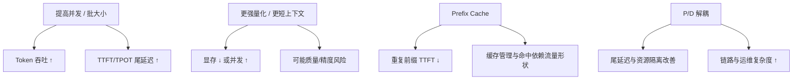

没有指标，优化只是感觉。LLM 推理又格外容易被单一数字带偏——有人只报吞吐，有人只盯首 Token，结果上线后用户直呼"又慢又抖"。这一节建立一套最小而完整的指标体系，并讲清指标之间的关联与 trade-off：你到底在为谁优化。

<!-- more -->

## 📑 目录

- [1. 为什么必须看一组指标](#1-为什么必须看一组指标)
- [2. 核心延迟指标：TTFT 与 TPOT](#2-核心延迟指标ttft-与-tpot)
- [3. 吞吐与 QPS](#3-吞吐与-qps)
- [4. 显存、利用率与饱和信号](#4-显存利用率与饱和信号)
- [5. 百分位、尾延迟与 SLO 表达](#5-百分位尾延迟与-slo-表达)
- [6. 常见 trade-off 地图](#6-常见-trade-off-地图)
- [总结](#-总结)
- [自我检验清单](#-自我检验清单)
- [参考资料](#-参考资料)

---

## 1. 为什么必须看一组指标

LLM 请求是两阶段过程：

- **Prefill**：吃完整 Prompt，决定首 Token 何时出现
- **Decode**：逐 Token 生成，决定"每个字要等多久"

因此至少要同时看：

| 指标族 | 代表用户感受 | 代表系统效率 |
|---|---|---|
| 延迟 | TTFT、TPOT、E2E | 调度是否伤到交互 |
| 吞吐 | 每秒输出 Token、QPS | 单位算力产出 |
| 资源 | 显存、KV 利用率、GPU Util | 是否还有余量 |
| 稳定性 | P95/P99、抢占、排队 | 高峰是否崩盘 |

📌 **关键点**：**单一指标无法反映全貌**。吞吐上去但 P99 TTFT 爆炸，对交互式产品仍是失败。

---

## 2. 核心延迟指标：TTFT 与 TPOT

### 2.1 TTFT（Time To First Token）

从请求到达（或客户端发出）到**首个输出 Token** 的时间。受影响于：

- 排队等待
- Prefill 计算（长度、是否 Chunked）
- 前缀缓存命中与否
- 多模态 Encoder 等前置成本

### 2.2 TPOT（Time Per Output Token）

稳定生成阶段，相邻输出 Token 的间隔（也常见报告为 tokens/s 的倒数）。受影响于：

- Decode 是否 Memory Bound、batch 大小
- 是否被长 Prefill 插入拖慢
- Speculative Decoding 接受率
- 抢占 / 抢 KV 导致的停顿

### 2.3 E2E Latency

端到端时间 ≈ 排队 + TTFT + TPOT × (输出 Token 数 − 1)（流式场景还要加网络）。**只报 E2E 会掩盖**"首包慢还是每字慢"。

🔑 **核心概念**：交互式产品优先护 TTFT 与 TPOT 的**高百分位**；批处理/离线摘要可以更多为吞吐让路。

---

## 3. 吞吐与 QPS

容易混淆的三个量：

| 名称 | 定义 | 用途 |
|---|---|---|
| QPS / RPM | 每秒（分）完成的请求数 | 容量与网关限流 |
| Output Throughput | 每秒生成的 Token 数 | 引擎效率 |
| Goodput | 满足 SLO 的有效吞吐 | 生产真实产能 |

注意：

- 短输出请求容易推高 QPS，但输出 Token 吞吐未必高
- 长输出反之
- 压测必须固定 **输入/输出长度分布**，否则数字不可比

💡 **提示**：对内报告同时给"请求吞吐"和"Token 吞吐"；对外 SLO 用用户可感知的延迟百分位。

---

## 4. 显存、利用率与饱和信号

| 信号 | 偏高意味着 | 常见后果 |
|---|---|---|
| 权重+激活显存 | 模型/并行策略偏重 | 可服务上下文变短 |
| KV Cache 利用率 | 并发与长度吃满池子 | 排队、抢占、拒绝 |
| GPU Compute Util | 算力忙碌 | Prefill 重或 batch 大 |
| GPU Mem Bandwidth Util | 带宽忙碌 | Decode 饱和的健康态 |
| 抢占次数 | KV 不够用 | TPOT/TTFT 尾部恶化 |
| 等待队列长度 | 入口过载 | TTFT 排队分量上升 |

⚠️ **注意**：Decode 场景下 **GPU Util 低不一定亏**——可能已是带宽打满。要用 Nsight / 指标区分 Compute Bound 与 Memory Bound，不能只看 Util 百分比。

---

## 5. 百分位、尾延迟与 SLO 表达

平均值会撒谎。推荐最少报告：

- TTFT：P50 / P95（交互再加 P99）
- TPOT：P50 / P95
- 成功率 / 超时率
- 在固定负载点下的 Token 吞吐

SLO 示例：

```text
在输入≈1k、输出≈200、QPS=X 的混合流量下：
- TTFT P95 ≤ 800ms
- TPOT P95 ≤ 30ms
- 错误率 ≤ 0.1%
```

没有负载前提的 SLO 无法验收。

---

## 6. 常见 trade-off 地图



决策直觉：

- 要**单位 GPU 产出** → 推高有效 batch / 缓存命中，接受更高延迟百分位
- 要**交互体验** → 限制排队、Chunked Prefill、必要时 P/D，接受更多 GPU
- 要**装下更长上下文** → 量化 / 并行 / 降并发，回到显存账本

📌 **关键点**：优化之前先写清**优化目标函数**。没有目标函数，技术选型一定会吵起来。

---

## 📝 总结

- LLM 推理必须同时看延迟、吞吐、资源与稳定性四类指标。
- TTFT 刻画首包，TPOT 刻画持续出字，E2E 不能替代二者。
- QPS 与 Token 吞吐含义不同；Goodput 才贴近生产产能。
- KV 利用率、抢占、队列长度是饱和的领先指标。
- 用 P95/P99 表达 SLO，并绑定负载形状。
- 吞吐与尾延迟、显存与质量之间存在系统性 trade-off。

## 🎯 自我检验清单

- 能定义 TTFT、TPOT，并写出近似 E2E 关系
- 能区分 QPS、Token 吞吐与 Goodput
- 能解释为何 Decode 下低 GPU Util 未必是问题
- 能列出至少三个饱和领先指标
- 能写一条带负载前提的 SLO
- 能举出两对典型指标 trade-off 及原因

## 📚 参考资料

- [vLLM — Metrics](https://docs.vllm.ai/en/latest/serving/metrics.html)
- [NVIDIA — LLM Inference Benchmarking Concepts](https://docs.nvidia.com/dynamo/latest/benchmarks/benchmark-guide.html)
- 本模块第 1～2 章关于 Prefill/Decode 与 KV 显存账本的讨论
