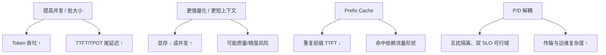

前八章把「装得下、跑得快、双 SLO、可控输出」的技术面铺完了；本章回答更刺耳的问题：**你怎么证明自己变好了，而不是只换了一种好看的数字？** 没有指标，优化只是感觉；指标选错，优化会把系统推向用户更差的方向——GPU 打满、Raw QPS 翻倍，一半请求违约（机制见 [7.4](../第7章-PD解耦架构/7.4-Goodput与SLO感知调度.md)）。这一节建立最小而完整的指标体系，并专门拆**分位数陷阱**：你到底在为谁优化。

<!-- more -->

## 📑 目录

- [1. 为什么必须看一组指标](#1-为什么必须看一组指标)
- [2. 延迟：TTFT、TPOT 与 ITL](#2-延迟ttfttpot-与-itl)
- [3. 吞吐、QPS 与 Goodput](#3-吞吐qps-与-goodput)
- [4. 利用率与饱和领先信号](#4-利用率与饱和领先信号)
- [5. 分位数陷阱与 SLO 写法](#5-分位数陷阱与-slo-写法)
- [6. 手算：均值合格、尾部翻车](#6-手算均值合格尾部翻车)
- [7. 常见 trade-off 地图](#7-常见-trade-off-地图)
- [8. 代价与权衡](#8-代价与权衡)
- [总结](#-总结)
- [自我检验清单](#-自我检验清单)
- [参考资料](#-参考资料)

---

## 1. 为什么必须看一组指标

LLM 请求是两阶段过程：

- **Prefill**：吃完整 Prompt，决定首 Token 何时出现；
- **Decode**：逐 Token 生成，决定「每个字要等多久」。

因此至少要同时看：

| 指标族 | 代表用户感受 | 代表系统效率 |
|---|---|---|
| 延迟 | TTFT、TPOT/ITL、E2E | 调度是否伤到交互 |
| 吞吐 | 输出 Token/s、QPS | 单位算力产出 |
| 有效产能 | **Goodput** | 满足 SLO 的真实产能 |
| 资源 | 显存、KV 利用率、GPU Util | 是否还有余量 |
| 稳定性 | P95/P99、抢占、排队、错误率 | 高峰是否崩盘 |

📌 **关键点**：**单一指标无法反映全貌**。吞吐上去但 P99 TTFT 爆炸，对交互式产品仍是失败；利用率 95% 却大量违约，是假忙。

---

## 2. 延迟：TTFT、TPOT 与 ITL

### 2.1 TTFT（Time To First Token）

从请求到达（或客户端发出）到**首个输出 Token** 的时间。主要分量：

- 排队等待；
- Prefill 计算（长度、是否 Chunked Prefill）；
- 前缀缓存命中与否（[2.3](../第2章-推理引擎核心技术/2.3-Prefix%20Cache%20与%20RadixAttention.md)；命中依赖流量形状，见 [9.2](./9.2-压测工具.md)）；
- 多模态 Encoder 等前置成本（[8.4](../第8章-生产级服务特性/8.4-多模态推理VLM.md)）。

### 2.2 TPOT 与 ITL

**TPOT（Time Per Output Token）**与 **ITL（Inter-Token Latency）**在多数语境下同指 Decode 阶段出字间隔；细微差别在是否把首 Token 算进去。GenAI-Perf 常见写法是排除首 Token：

\[
\text{ITL} = \frac{\text{e2e\_latency} - \text{TTFT}}{\text{输出 Token 数} - 1}
\]

受影响于：Decode 是否 Memory Bound、batch 大小、长 Prefill 插入、投机接受率（[5.4](../第5章-Speculative-Decoding/5.4-收益边界与限制.md)）、抢占导致的停顿。

### 2.3 E2E Latency

端到端时间 ≈ 排队 + TTFT + TPOT × (输出 Token 数 − 1)（流式还要加网络）。**只报 E2E 会掩盖**「首包慢还是每字慢」。

🔑 **核心概念**：交互式产品优先护 TTFT 与 TPOT/ITL 的**高百分位**；批处理/离线摘要可以更多为吞吐让路。对比实验时写明用的是 TPOT 还是 ITL，避免跨工具对不上账。

---

## 3. 吞吐、QPS 与 Goodput

容易混淆的四个量：

| 名称 | 定义 | 用途 | 盲区 |
|---|---|---|---|
| QPS / RPM | 每秒（分）完成的请求数 | 容量与网关限流 | 短输出虚高 |
| Output Throughput | 每秒生成的 Token 数 | 引擎效率 | 是否违约 |
| GPU 利用率 | SM/忙碌占比 | 粗饱和信号 | 忙着干坏事 |
| **Goodput** | 满足全部 SLO 的有效吞吐 | 生产真实产能 | 需清晰 SLO |

注意：

- 短输出推高 QPS，Token 吞吐未必高；长输出反之；
- 压测必须固定**输入/输出长度分布**，否则数字不可比；
- Raw QPS 含超时重试时会「越差越高」（[7.4](../第7章-PD解耦架构/7.4-Goodput与SLO感知调度.md)）。

💡 **提示**：对内报告同时给「请求吞吐」和「Token 吞吐」；对外 SLO 与发布对比用 **Goodput + 延迟百分位**，而不是峰值 tokens/s。

---

## 4. 利用率与饱和领先信号

| 信号 | 偏高意味着 | 常见后果 |
|---|---|---|
| 权重+激活显存 | 模型/并行策略偏重 | 可服务上下文变短 |
| KV Cache 利用率 | 并发与长度吃满池子 | 排队、抢占、拒绝 |
| GPU Compute Util | 算力忙碌 | Prefill 重或 batch 大 |
| GPU Mem Bandwidth Util | 带宽忙碌 | Decode 饱和的健康态 |
| 抢占次数 | KV 不够用 | TPOT/TTFT 尾部恶化 |
| 等待队列长度 | 入口过载 | TTFT 排队分量上升 |

⚠️ **注意**：Decode 场景下 **GPU Util 低不一定亏**——可能已是带宽打满。要用 [9.3](./9.3-性能分析工具.md) 区分 Compute Bound 与 Memory Bound，不能只看 Util 百分比。利用率是仪表，不是优化目标。

---

## 5. 分位数陷阱与 SLO 写法

平均值会撒谎；只报「某一个」百分位也会撒谎。常见陷阱：

1. **只报 P50**：交互产品的痛苦在尾部，P50 漂亮无法验收；
2. **只报 P99 且样本不足**：100 个样本里的「P99」几乎是噪声；
3. **跨负载比百分位**：短 Prompt 的 TTFT P95 不能和长上下文混比；
4. **SLO 无负载前提**：没有「在何种到达率/长度分布下」的延迟上限无法验收；
5. **用平均值冒充分位数**：营销材料常见手法，工程上直接作废。

推荐最少报告：

- TTFT：P50 / P95（交互再加 P99，且注明样本量）；
- TPOT 或 ITL：P50 / P95；
- 成功率 / 超时率；
- 固定负载点下的 Token 吞吐与 **Goodput**。

SLO 示例：

```text
在输入≈1k、输出≈200、到达率=8 req/s 的混合流量下：
- TTFT P95 ≤ 800ms
- TPOT P95 ≤ 30ms
- 错误率 ≤ 0.1%
- Goodput 以双 SLO 同时满足计
```

没有负载前提的 SLO 无法验收；没有样本量的极端分位不可信。

---

## 6. 手算：均值合格、尾部翻车

教学示意（**非某集群实测**；单位 ms）。观测窗内完成 1000 次请求的 TTFT：

- 方案 A（限流保守）：900 次 ≈ 400 ms，100 次 ≈ 900 ms；
- 方案 B（塞满并发）：700 次 ≈ 300 ms，300 次 ≈ 2500 ms。

粗算：

| 方案 | 均值 TTFT | P50 | P95（约） | 叙事 |
|---|---|---|---|---|
| A | $(900\cdot400+100\cdot900)/1000=450\,\mathrm{ms}$ | ~400 ms | ~900 ms | 「没打满」 |
| B | $(700\cdot300+300\cdot2500)/1000=960\,\mathrm{ms}$ | ~300 ms | ~2500 ms | 「P50 更快」 |

若 SLO 是 TTFT P95 ≤ 1000 ms：A 过、B 不过。取舍句：**B 的 P50 更好、均值更差、P95 翻车**——若门禁只看均值或 P50，会把 B 判赢；按交互 SLO，应选 A 或继续改调度，而不是庆祝「中位数加速」。

再叠一层 Goodput（同窗 100 s）：A 完成 800 请求且 760 合格 → Goodput $7.6\,\mathrm{req/s}$；B 完成 1200 但仅 700 合格 → Goodput $7.0\,\mathrm{req/s}$。Raw 更高、有效更低——与 [7.4](../第7章-PD解耦架构/7.4-Goodput与SLO感知调度.md) 同一逻辑。

---

## 7. 常见 trade-off 地图



决策直觉：

- 要**单位 GPU 产出** → 推高有效 batch / 缓存命中，接受更高延迟百分位；
- 要**交互体验** → 限制排队、Chunked Prefill、必要时 P/D，接受更多 GPU；
- 要**装下更长上下文** → 量化 / 并行 / 降并发，回到显存账本。

📌 **关键点**：优化之前先写清**优化目标函数**（例如「目标并发下 Goodput 最大，且 TTFT/TPOT P95 不破」）。没有目标函数，技术选型一定会吵起来。

---

## 8. 代价与权衡

| 选择 | 收益 | 代价 / 不适用 |
|---|---|---|
| 以 Goodput + P95 为门禁 | 避免假优化 | 要稳定压测与清晰 SLO |
| 只报峰值 tokens/s | 好看、好讲故事 | 交互体验不可验收 |
| 只盯 GPU Util | 粗看是否空转 | Decode 带宽饱和时误判 |
| 极严 P99 + 小样本 | 看似关心尾部 | 噪声把门禁打成抽奖 |
| 无负载前提的延迟上限 | 口号简单 | 无法复现、无法回归 |

适用：已能固定负载形状，并区分 Prefill/Decode 贡献。  
若还在用「平均延迟 + 利用率」拍板，先改仪表（本节），再谈压测与分析工具（[9.2](./9.2-压测工具.md)–[9.3](./9.3-性能分析工具.md)）。

---

## 📝 总结

- LLM 推理必须同时看延迟、吞吐、Goodput、资源与稳定性；单一数字必偏。
- TTFT 刻画首包，TPOT/ITL 刻画持续出字；写明定义再对比工具结果。
- QPS 与 Token 吞吐含义不同；**Goodput** 才贴近生产产能。
- Decode 下低 GPU Util 未必亏；KV/抢占/队列是更领先的饱和信号。
- 分位数要绑负载前提与样本量；均值/P50 合格不能掩盖 P95 翻车。
- 吞吐与尾延迟、显存与质量之间存在系统性 trade-off——先写目标函数。

## 🎯 自我检验清单

- 能定义 TTFT、TPOT/ITL，并写出近似 E2E 关系
- 能区分 QPS、Token 吞吐与 Goodput，并举一个 Raw 升、Goodput 降的例子
- 能解释为何 Decode 下低 GPU Util 未必是问题
- 能点名至少三种分位数陷阱（含样本量或负载前提）
- 能口述「均值/P50 合格、P95 翻车」的示意账
- 能写一条带负载前提的双 SLO，并说明优化目标函数

## 📚 参考资料

- [vLLM — Metrics](https://docs.vllm.ai/en/latest/serving/metrics.html)
- [NVIDIA — LLM Inference Benchmarking Concepts](https://docs.nvidia.com/dynamo/latest/benchmarks/benchmark-guide.html)
- [DistServe: Goodput-optimized LLM Serving](https://arxiv.org/abs/2401.09670)
- [本模块 1.1 LLM 推理基础（含 TTFT/TPOT/Goodput）](../第1章-LLM推理基础/1.1-LLM推理基础.md)
- [本模块 7.4 Goodput 与 SLO 感知调度](../第7章-PD解耦架构/7.4-Goodput与SLO感知调度.md)
- [本模块 9.2 压测工具](./9.2-压测工具.md)
