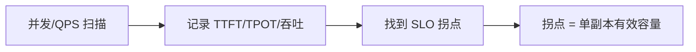

指标体系有了，还得有稳定的尺子。压测工具选错、参数漂移、数据集随手改，都会让"优化有效"变成错觉。这一节以 vLLM 自带基准工具为主，兼顾 GenAI-Perf，并给出可复现配置的最低标准。

<!-- more -->

## 📑 目录

- [1. 压测前要钉死的变量](#1-压测前要钉死的变量)
- [2. vllm bench 三件套](#2-vllm-bench-三件套)
- [3. GenAI-Perf 与其它工具](#3-genai-perf-与其它工具)
- [4. 设计一个可信的压测场景](#4-设计一个可信的压测场景)
- [5. 可复现配置管理](#5-可复现配置管理)
- [6. 常见误区](#6-常见误区)
- [总结](#-总结)
- [自我检验清单](#-自我检验清单)
- [参考资料](#-参考资料)

---

## 1. 压测前要钉死的变量

每次对比实验至少固定：

| 变量 | 示例 |
|---|---|
| 模型与精度 | 权重路径、量化方式、Tokenizer |
| 硬件与拓扑 | GPU 型号、数量、TP/PP、驱动/CUDA |
| 引擎版本与关键 flag | vLLM 版本、chunked prefill、前缀缓存开关 |
| 负载形状 | 输入/输出长度分布、并发、是否流式 |
| 采样参数 | Temperature、max tokens、stop |
| 预热与持续时间 | warmup 请求数、正式压测时长 |

📌 **关键点**：改了一个 flag 却同时换了数据集，结论作废。一次只动一个自变量。

---

## 2. vllm bench 三件套

vLLM 提供面向不同问题的子命令（具体参数以当前版本 `--help` 为准）：

### 2.1 `vllm bench latency`

偏**单请求/低并发延迟**画像，适合看 TTFT/TPOT 基线、回归引擎改动对延迟的影响。

### 2.2 `vllm bench throughput`

偏**极限吞吐**，尽快打满引擎，回答"这张卡最高能吐多少 Token/s"。适合容量上界与 kernel/图优化对比。

### 2.3 `vllm bench serve`

对已经拉起的 OpenAI 兼容服务做在线压测，输出更贴近生产的 QPS、TTFT、TPOT、吞吐等综合报告。适合：

- 版本发布前验收
- 配置调优（并发、队列、缓存开关）
- 多副本前的单副本摸高

```bash
# 概念示例：对本地服务做 serve 压测
vllm bench serve \
  --backend vllm \
  --model <model-name> \
  --host 127.0.0.1 \
  --port 8000 \
  --dataset-name sharegpt \
  --num-prompts 1000 \
  --request-rate 8
```

💡 **提示**：`request-rate` 与并发模型不同——一个控制到达率，一个控制飞行中请求数。要画饱和曲线，建议从低到高扫多个负载点。

---

## 3. GenAI-Perf 与其它工具

| 工具 | 特点 | 适用 |
|---|---|---|
| **GenAI-Perf** | NVIDIA 生态，LLM 指标一站式（TTFT/ITL/吞吐等） | Triton / NIM / 兼容端点对比 |
| Triton Perf Analyzer | 传统 Triton 模型分析 | 非 LLM 或 Triton 管道 |
| 自定义脚本 | 完全贴合业务 trace | 生产流量回放 |

GenAI-Perf 的价值在于：**跨服务实现用同一套指标定义对话**，减少"我家 TTFT 和他家 TTFT 不是一个东西"的扯皮。若你的栈已在 NVIDIA 推理生态，值得纳入标准工具箱。

---

## 4. 设计一个可信的压测场景

推荐三层场景：

1. **微观基线**：固定输入 L_in、输出 L_out，并发=1，测延迟底座
2. **饱和曲线**：逐步提高 QPS/并发，记录 TTFT/TPOT P95 与吞吐，找到 SLO 拐点
3. **业务混合**：按线上长度分布与系统提示复用率回放，验证缓存与调度假设



数据集建议：

- 公开集（ShareGPT 等）用于横向对比
- **脱敏生产 trace** 用于上线决策
- 明确是否包含超长尾请求（P99 长度）

---

## 5. 可复现配置管理

把一次基准固化为机器可读清单，例如：

```yaml
benchmark_id: chat-7b-fp8-2026-08-10
model: org/model-7b-fp8
engine: vllm==x.y.z
flags:
  max_model_len: 8192
  enable_prefix_caching: true
  gpu_memory_utilization: 0.9
hardware:
  gpu: H100-80GB
  tp: 1
workload:
  dataset: sharegpt_v3_sample
  num_prompts: 1000
  request_rate: [1, 2, 4, 8, 12]
  streaming: true
sampling:
  temperature: 0.0
  max_tokens: 256
warmup_requests: 50
seed: 42
```

配套要求：

- 结果 JSON/CSV 与配置同目录归档
- CI 或手工复跑时对比 diff，而不是只看截图
- 记录环境：驱动、CUDA、容器镜像 digest

🔑 **核心概念**：**可复现 = 配置 + 数据 + 环境 + 种子** 四元组，缺一不可。

---

## 6. 常见误区

- 只报最大值吞吐，不报达到该点时的 P95 延迟
- 压测不含排队：客户端并发无限，把网关/客户端打成瓶颈还以为是引擎问题
- 预热不足：把冷启动、编译、缓存填充算进正式窗口
- 流式与非流式混比
- 用 Temperature>0 做性能对比却不修种子，把随机当回归

⚠️ **注意**：客户端与网络可能成为瓶颈。先确认压测机 CPU、网卡和 HTTP 客户端不是短板，再给引擎下结论。

---

## 📝 总结

- 压测前固定模型、硬件、版本、负载与采样等变量。
- `latency` / `throughput` / `serve` 分别回答基线延迟、上限吞吐与在线综合表现。
- GenAI-Perf 适合跨实现统一指标对话；业务决策还要靠生产形状回放。
- 用饱和曲线找 SLO 拐点，把拐点当单副本有效容量。
- 配置 YAML + 结果归档 + 环境 digest 是可复现的底线。

## 🎯 自我检验清单

- 能说明三次 `vllm bench` 子命令各自回答什么问题
- 能区分 request rate 与并发飞行数
- 能设计"基线—饱和—混合"三层压测
- 能写出一份含硬件与 workload 的可复现配置
- 能点名至少三个导致基准不可信的误区
- 能解释为何要用生产 trace 做上线决策

## 📚 参考资料

- [vLLM — Benchmarking](https://docs.vllm.ai/en/latest/benchmarking/)
- [GenAI-Perf 文档](https://docs.nvidia.com/deeplearning/triton-inference-server/user-guide/docs/perf_analyzer/genai-perf/README.html)
- [Triton Perf Analyzer](https://github.com/triton-inference-server/perf_analyzer)
