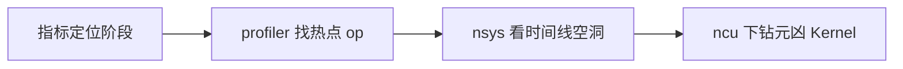

[9.2](./9.2-压测工具.md) 告诉你「慢了多少、在哪个负载点破 SLO」；这一节回答「慢在哪里」。推理场景的坑在于：Python 开销、CPU 调度、PCIe、Kernel launch、以及 Memory Bound Decode，表面都可能长成「GPU Util 不高」。工具链是 **torch.profiler → Nsight Systems → Nsight Compute**——**何时用哪一层**比会敲命令更重要。

<!-- more -->

## 📑 目录

- [1. 分层分析与何时升级工具](#1-分层分析与何时升级工具)
- [2. torch.profiler：算子与框架层](#2-torchprofiler算子与框架层)
- [3. Nsight Systems：全链路时间线](#3-nsight-systems全链路时间线)
- [4. Nsight Compute：Kernel 级下钻](#4-nsight-computekernel-级下钻)
- [5. CPU vs GPU 瓶颈判读](#5-cpu-vs-gpu-瓶颈判读)
- [6. 推理场景实践与排查表](#6-推理场景实践与排查表)
- [7. 最小工具箱清单](#7-最小工具箱清单)
- [8. 代价与权衡](#8-代价与权衡)
- [总结](#-总结)
- [自我检验清单](#-自我检验清单)
- [参考资料](#-参考资料)

---

## 1. 分层分析与何时升级工具

| 层级 | 问题 | 工具 | 何时用 |
|---|---|---|---|
| 服务/调度 | 排队？抢占？缓存未命中？ | vLLM metrics、日志 | **永远先看**；多数回归止步于此 |
| 框架/算子 | 哪个 op 占比高？CPU 是否堵？ | torch.profiler | 指标指向引擎内部，需热点 op |
| 系统时间线 | Kernel 间隙、拷贝、同步、多进程 | Nsight Systems (nsys) | profiler 显示 GPU 闲或空隙异常 |
| 单 Kernel | 带宽/占用率/指令瓶颈 | Nsight Compute (ncu) | nsys 已锁定个别长耗时 Kernel |

📌 **关键点**：**先粗后细**。上来就对几十个 Kernel 跑 ncu，成本极高且容易抓错对象；很多「性能问题」其实是排队、KV 抢占或客户端瓶颈（回到 [9.1](./9.1-推理指标体系.md)–[9.2](./9.2-压测工具.md)）。



升级条件（经验口令）：

- 还在问「是否破 SLO / 是否排队」→ 别开 profiler；
- 已确认引擎内变慢、需分 Prefill/Decode → profiler；
- GPU 轨道大片空白或同步密布 → nsys；
- 同一 Kernel 在 good/bad 版本时长差显著 → ncu。

---

## 2. torch.profiler：算子与框架层

适用：确认时间花在 Attention / GEMM / 采样 / 数据预处理，还是 Python 调度。

```python
import torch
from torch.profiler import profile, ProfilerActivity

with profile(
    activities=[ProfilerActivity.CPU, ProfilerActivity.CUDA],
    record_shapes=True,
    with_stack=True,
) as prof:
    run_inference_warmup_and_steps()

print(prof.key_averages().table(sort_by="cuda_time_total", row_limit=20))
prof.export_chrome_trace("trace.json")
```

解读要点：

- 看 `cuda_time_total` 找 GPU 热点；
- 看 CPU 时间与 `cudaStreamSynchronize` 判断是否被同步拖死；
- Chrome Trace 观察是否有「锯齿状」空隙（launch 不足或同步过多）。

💡 **提示**：推理服务进程复杂，优先在**可复现的离线脚本**或受控 benchmark 路径里打 profiler，再映射回在线配置；正式压测窗不要开全量 profiling（会扭曲数字）。

---

## 3. Nsight Systems：全链路时间线

Nsight Systems 回答：GPU 是否吃饱？空隙是在等 CPU、等拷贝，还是等其它 rank？

常见关注带：

- CUDA API / Kernel 轨道：launch 密度、时长；
- Memory：HtoD/DtoH/DtoD 是否抢拍；
- NVTX 标注：把 Prefill/Decode/采样区间标出来；
- 多 GPU：NCCL 是否插入过长集合通信。

```bash
nsys profile -o serve_decode \
  --trace=cuda,nvtx,osrt \
  --force-overwrite=true \
  <your-benchmark-command>
```

解读口诀：

- **大段空白 + GPU 闲**：CPU 供不上或锁/同步；
- **Kernel 满但吞吐差**：可能选错 Kernel / 图未捕获 / 形状太小；
- **Decode 阶段短 Kernel 密布**：注意 launch overhead 与是否应 CUDA Graph。

🔑 **核心概念**：Systems 看的是**时间线结构**，不是单个 Kernel 的理论 FLOPs。它是 good/bad 提交对比的主武器（配合 [9.5](./9.5-性能回归门禁.md) 的 bisect）。

---

## 4. Nsight Compute：Kernel 级下钻

当 nsys 定位到某个长耗时 Kernel（如 Attention、GEMM）后，再用 ncu：

- 看 Memory Throughput vs Compute Throughput，判断 Bound 类型；
- 看 Occupancy、Warp Stall 原因；
- 对比优化前后同一 Kernel 的指标差分。

```bash
ncu --set full -o attn_kernel \
  --kernel-name-base demangled \
  <command-that-runs-target-kernel>
```

⚠️ **注意**：ncu 开销极大，会严重扭曲端到端延迟。它用于**微观对比**，不要拿 ncu 过程中的 E2E 当性能数字，更不要写进对外榜单。

---

## 5. CPU vs GPU 瓶颈判读

把「Util 低」翻译成可行动结论：

| 观察 | 更可能是 | 下一步 |
|---|---|---|
| GPU 轨道大片空白，CPU 忙/锁多 | **CPU / 调度瓶颈** | 减同步、减 Python 热路径、查锁与 tokenizer |
| GPU 满，Mem Bandwidth 高，Compute 一般 | **Memory Bound（常见 Decode）** | 提有效 batch、KV 量化、减多余读写 |
| GPU 满，Compute 高，带宽有余 | **Compute Bound（常见大 Prefill）** | 算子/精度/并行与切分 |
| 短 Kernel 极密，空隙是 launch | **Launch overhead** | CUDA Graph、合并小核 |
| 拷贝轨道与 Kernel 抢拍 | **PCIe / 传输** | 固定页、重叠加、查 P/D 传输（[7.3](../第7章-PD解耦架构/7.3-KV-Cache传输与Connector.md)） |
| NCCL 长条插入 | **通信瓶颈** | 查 TP/PP、消息大小与拓扑 |

教学示意（**非实测**；单位 ms/step Decode）：

- 基线步时长 $12\,\mathrm{ms}$，其中 Kernel 合计 $10\,\mathrm{ms}$，空隙 $2\,\mathrm{ms}$ → 主要在 GPU；
- 回归后步时长 $18\,\mathrm{ms}$，Kernel 仍约 $10\,\mathrm{ms}$，空隙 $8\,\mathrm{ms}$ → **先查 CPU/同步/调度**，而不是先改 Attention Kernel。

取舍句：**空隙从 2 ms 涨到 8 ms 时，上 ncu 优化 Kernel 往往是错层**——先 nsys 看谁在供不上，再决定是否下钻。

---

## 6. 推理场景实践与排查表

最佳实践：

1. **分阶段采样**：Prefill 长请求与 Decode 稳态分开抓；
2. **固定形状**：`batch、seqlen、num_tokens` 固定，否则 Kernel 选择漂移；
3. **先关无关特性**：工具调用解析、额外日志、高 logprobs 会污染画像；
4. **标注 NVTX**：否则时间线难读；
5. **保存原始报告**：`nsys-rep`、`ncu-rep`、profiler trace 归档；
6. **权限与环境**：容器内 profiling 常需额外 capability。

| 症状 | 先看 | 可能原因 |
|---|---|---|
| TTFT 高、TPOT 正常 | metrics 队列 + profiler Prefill | 排队、长 Prompt、缓存未命中 |
| TPOT 高、Util 低 | nsys 时间线 | 同步过多、launch 稀疏、CPU 瓶颈 |
| TPOT 高、带宽高 | Bound 类型 | 已 Memory Bound：减 KV 流量/提 batch |
| 某次版本回归 | 同负载 nsys 对比 | 新 op、图捕获失败、通信变多 |
| 单 Kernel 变慢 | ncu diff | 实现回退、tile 变化、对齐问题 |

📌 **关键点**：把「工具产出」翻译回 [9.1](./9.1-推理指标体系.md) 的语言——最终要解释 TTFT/TPOT/吞吐为何变，而不是停在「Occupancy 是 37%」。

---

## 7. 最小工具箱清单

团队冷启动时先保证：

1. 固定的 `vllm bench` 脚本（可复现，见 [9.2](./9.2-压测工具.md)）；
2. 一份 torch profiler / Chrome Trace 抓取说明；
3. 一台装好 `nsys` 的同型号 GPU 调试机；
4. 热点 Kernel 的 `ncu` 对比模板（good vs bad）；
5. 结果目录约定：`date_commit_workload/`。

有了这五样，[9.5](./9.5-性能回归门禁.md) 的回归定位才跑得起来。

---

## 8. 代价与权衡

| 选择 | 收益 | 代价 / 不适用 |
|---|---|---|
| 只靠 metrics | 快、低扰动 | 定位不了 Kernel/同步结构 |
| 常开 profiler/nsys | 细节多 | 扭曲延迟，污染压测数字 |
| 动辄全量 ncu | 微观真相 | 极慢；E2E 数字作废 |
| good/bad nsys 对比 | 回归根因清晰 | 要固定负载与形状 |
| 先猜 Kernel 再优化 | 偶尔蒙对 | 多数时间浪费在错层 |

适用：压测已复现问题负载点，且排除客户端瓶颈。  
若连「破的是 TTFT 还是 TPOT」都说不清，先回到指标体系与压测，而不是打开 Nsight。

---

## 📝 总结

- 性能分析应分层：指标 → profiler → nsys → ncu；按升级条件进入下一层。
- torch.profiler 擅长框架/算子热点与 CPU–GPU 互动。
- Nsight Systems 揭示时间线空洞、拷贝与通信，是回归对比主力。
- Nsight Compute 用于确认单个 Kernel 的 Bound；其过程中的 E2E 不可用。
- CPU vs GPU 判读看「空隙 vs Kernel 时长」与带宽/算力吞吐，避免 Util 迷信。
- 结论必须映射回 TTFT/TPOT/吞吐；先备齐最小工具箱再谈自动化门禁。

## 🎯 自我检验清单

- 能说明三种工具各自回答的问题层级，以及何时升级
- 能解读 profiler 表中 cuda/cpu 时间含义
- 能从 nsys 时间线判断 GPU 闲是 CPU 还是同步导致
- 能用「空隙变长、Kernel 不变」的示意说明错层优化风险
- 知道 ncu 结果不能直接当端到端性能
- 能针对 TTFT 高 / TPOT 高给出不同排查路径

## 📚 参考资料

- [PyTorch Profiler](https://pytorch.org/tutorials/recipes/recipes/profiler_recipe.html)
- [Nsight Systems User Guide](https://docs.nvidia.com/nsight-systems/)
- [Nsight Compute Documentation](https://docs.nvidia.com/nsight-compute/)
- [本模块 9.1 推理指标体系](./9.1-推理指标体系.md)
- [本模块 9.2 压测工具](./9.2-压测工具.md)
- [本模块 9.5 性能回归门禁](./9.5-性能回归门禁.md)
