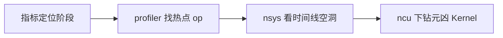

压测告诉你"慢了多少"，分析工具告诉你"慢在哪里"。推理场景的坑在于：Python 开销、CPU 调度、PCIe、Kernel launch、以及 Memory Bound Decode，可能长得很像"GPU Util 不高"。这一节给出从粗到细的工具链：torch.profiler → Nsight Systems → Nsight Compute。

<!-- more -->

## 📑 目录

- [1. 分层分析思路](#1-分层分析思路)
- [2. torch.profiler：算子与框架层](#2-torchprofiler算子与框架层)
- [3. Nsight Systems：全链路时间线](#3-nsight-systems全链路时间线)
- [4. Nsight Compute：Kernel 级下钻](#4-nsight-computekernel-级下钻)
- [5. 推理场景最佳实践](#5-推理场景最佳实践)
- [6. 案例化排查路径](#6-案例化排查路径)
- [7. 最小工具箱清单](#7-最小工具箱清单)
- [总结](#-总结)
- [自我检验清单](#-自我检验清单)
- [参考资料](#-参考资料)

---

## 1. 分层分析思路

| 层级 | 问题 | 工具 |
|---|---|---|
| 服务/调度 | 排队？抢占？缓存未命中？ | vLLM metrics、日志 |
| 框架/算子 | 哪个 op 占比高？CPU 侧是否堵？ | torch.profiler |
| 系统时间线 | Kernel 间隙、拷贝、同步、多进程 | Nsight Systems (nsys) |
| 单 Kernel | 带宽/占用率/指令瓶颈 | Nsight Compute (ncu) |

📌 **关键点**：**先粗后细**。上来就对几十个 Kernel 跑 ncu，成本极高且容易抓错对象。



---

## 2. torch.profiler：算子与框架层

适用：确认时间花在 Attention / GEMM / 采样 / 数据预处理，还是 Python 调度。

基本用法思路：

```python
import torch
from torch.profiler import profile, ProfilerActivity

with profile(
    activities=[ProfilerActivity.CPU, ProfilerActivity.CUDA],
    record_shapes=True,
    with_stack=True,
) as prof:
    run_inference_warmup_and_steps()

print(prof.key_averages().table(sort_by="cuda_time_total", row_limit=20))
prof.export_chrome_trace("trace.json")
```

解读要点：

- 看 `cuda_time_total` 找 GPU 热点
- 看 CPU 时间与 `cudaStreamSynchronize` 判断是否被同步拖死
- Chrome Trace 观察是否有"锯齿状"空隙（launch 不足或同步过多）

💡 **提示**：推理服务进程复杂，优先在**可复现的离线脚本**或受控 benchmark 路径里打 profiler，再映射回在线配置。

---

## 3. Nsight Systems：全链路时间线

Nsight Systems 回答：GPU 是否吃饱？空隙是在等 CPU、等拷贝，还是等其它 rank？

常见关注带：

- CUDA API / Kernel 轨道：launch 密度、时长
- Memory：HtoD/DtoH/DtoD 是否抢拍
- NVTX 标注：把 Prefill/Decode/采样区间标出来
- 多 GPU：NCCL 是否插入过长集合通信

```bash
nsys profile -o serve_decode \
  --trace=cuda,nvtx,osrt \
  --force-overwrite=true \
  <your-benchmark-command>
```

解读口诀：

- **大段空白 + GPU 闲**：CPU 供不上或锁/同步
- **Kernel 满但吞吐差**：可能选错 Kernel / 图未捕获 / 形状太小
- **Decode 阶段短 Kernel 密布**：注意 launch overhead 与是否应 CUDA Graph

🔑 **核心概念**：Systems 看的是**时间线结构**，不是单个 Kernel 的理论 FLOPs。

---

## 4. Nsight Compute：Kernel 级下钻

当 nsys 定位到某个长耗时 Kernel（如 Attention、GEMM）后，再用 ncu：

- 看 Memory Throughput vs Compute Throughput，判断 Bound 类型
- 看 Occupancy、Warp Stall 原因
- 对比优化前后同一 Kernel 的指标差分

```bash
ncu --set full -o attn_kernel \
  --kernel-name-base demangled \
  <command-that-runs-target-kernel>
```

⚠️ **注意**：ncu 开销极大，会严重扭曲端到端延迟。它用于**微观对比**，不要拿 ncu 过程中的 E2E 当性能数字。

---

## 5. 推理场景最佳实践

1. **分阶段采样**：Prefill 长请求与 Decode 稳态分开抓
2. **固定形状**：`batch、seqlen、num_tokens` 固定，否则 Kernel 选择漂移
3. **先关无关特性**：工具调用解析、额外日志、高 logprobs 会污染画像
4. **标注 NVTX**：在引擎或 bench 里打区间，否则时间线难读
5. **保存原始报告**：`qdrep`/`nsys-rep`、`ncu-rep`、profiler trace 一并归档
6. **权限与环境**：容器内 profiling 常需额外 capability；CI 机器可能无 GPU 计数器权限

---

## 6. 案例化排查路径

| 症状 | 先看 | 可能原因 |
|---|---|---|
| TTFT 高、TPOT 正常 | metrics 队列 + profiler Prefill | 排队、长 Prompt、缓存未命中 |
| TPOT 高、Util 低 | nsys 时间线 | 同步过多、launch 稀疏、CPU 瓶颈 |
| TPOT 高、带宽高 | 可能已 Memory Bound | 降 KV 流量、量化 KV、提有效 batch |
| 某次版本回归 | 同负载 nsys 对比 | 新 op、图捕获失败、通信变多 |
| 单 Kernel 变慢 | ncu diff | 实现回退、tile 变化、对齐问题 |

📌 **关键点**：把"工具产出"翻译回第 9.1 节的指标语言——最终要解释 TTFT/TPOT/吞吐为何变，而不是停在"Occupancy 是 37%"。

---

## 7. 最小工具箱清单

团队冷启动时，不必一次上齐所有商业特性，先保证：

1. 固定的 `vllm bench` 脚本（可复现）
2. 一份 torch profiler / Chrome Trace 抓取说明
3. 一台装好 `nsys` 的同型号 GPU 调试机
4. 热点 Kernel 的 `ncu` 对比模板（good vs bad）
5. 结果目录约定：`date_commit_workload/`

有了这五样，第 9.5 节的回归定位才跑得起来。

---

## 📝 总结

- 性能分析应分层：指标 → profiler → nsys → ncu。
- torch.profiler 擅长框架/算子热点与 CPU-GPU 互动。
- Nsight Systems 揭示时间线空洞、拷贝与通信。
- Nsight Compute 用于确认单个 Kernel 的 Bound 与回归原因。
- 推理场景要分 Prefill/Decode、固定形状，并谨慎解读 ncu 下的 E2E。
- 结论必须能映射回 TTFT/TPOT/吞吐等产品指标。
- 先备齐最小工具箱，再谈自动化门禁。

## 🎯 自我检验清单

- 能说明三种工具各自回答的问题层级
- 能解读 profiler 表中 cuda/cpu 时间含义
- 能从 nsys 时间线判断 GPU 闲是 CPU 还是同步导致
- 知道 ncu 结果不能直接当端到端性能
- 能针对 TTFT 高 / TPOT 高给出不同排查路径
- 能列出推理 profiling 的至少四条实践准则

## 📚 参考资料

- [PyTorch Profiler](https://pytorch.org/tutorials/recipes/recipes/profiler_recipe.html)
- [Nsight Systems User Guide](https://docs.nvidia.com/nsight-systems/)
- [Nsight Compute Documentation](https://docs.nvidia.com/nsight-compute/)
