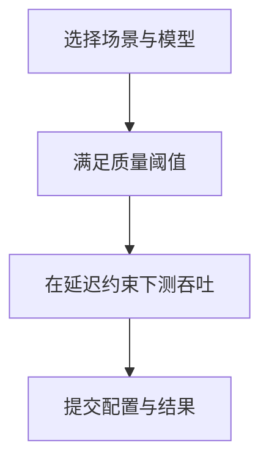

[9.1](./9.1-推理指标体系.md)–[9.3](./9.3-性能分析工具.md) 解决「自己系统有没有变好、慢在哪」；权威基准解决「在公认规则下能不能横向对话」。两者不能互相替代——把榜单当施工图，或把本机一跑当「复现了 MLPerf」，都是常见翻车。这一节强调**读榜注意事项**与**本机复现边界**，弱化「跑个分」叙事。

<!-- more -->

## 📑 目录

- [1. 权威基准的价值与边界](#1-权威基准的价值与边界)
- [2. MLPerf Inference 速览](#2-mlperf-inference-速览)
- [3. 从传统基准到 LLM 场景](#3-从传统基准到-llm-场景)
- [4. 读榜注意事项](#4-读榜注意事项)
- [5. 本机复现边界](#5-本机复现边界)
- [6. 团队内部的「准权威」基线](#6-团队内部的准权威基线)
- [7. 榜单在决策流中的位置](#7-榜单在决策流中的位置)
- [8. 代价与权衡](#8-代价与权衡)
- [总结](#-总结)
- [自我检验清单](#-自我检验清单)
- [参考资料](#-参考资料)

---

## 1. 权威基准的价值与边界

| ✅ 权威基准擅长 | ❌ 权威基准不擅长 |
|---|---|
| 统一负载与指标定义 | 复刻你的业务 Prompt 分布 |
| 硬件/软件栈横向对比 | 直接给出你的容量规划数字 |
| 推动可复现与审报纪律 | 覆盖你的多租户/工具调用细节 |
| 发现明显回退与代差 | 代替质量评测（正确性/安全性） |

📌 **关键点**：榜单是**坐标系**，不是**施工图**。上线决策仍要以业务 SLO + 自有压测为准（[9.2](./9.2-压测工具.md)、[9.5](./9.5-性能回归门禁.md)）。

---

## 2. MLPerf Inference 速览

MLPerf Inference 由 MLCommons 组织，面向数据中心与边缘等场景，强调：

- **固定模型与质量阈值**（精度不能为了速度无底下探）；
- **明确的延迟约束**（Server / Offline 等场景规则不同）；
- **可提交、可复核的结果流程**。

对 LLM / 生成式负载，关注点从「每秒样本」扩展到受延迟约束的 Token 生成效率。读提交结果时务必看清：

- 场景（Server vs Offline 等）；
- 模型与精度；
- 硬件型号与规模；
- 是否在延迟约束内统计。



🔑 **核心概念**：MLPerf 比的是**约束下的有效吞吐**，不是无约束刷分。这与 [7.4](../第7章-PD解耦架构/7.4-Goodput与SLO感知调度.md) / [9.1](./9.1-推理指标体系.md) 的 Goodput 精神同向。

---

## 3. 从传统基准到 LLM 场景

传统图像分类基准假设：固定输入尺寸、单次前向、批次清晰。LLM 推理则不同：

- 输入/输出长度可变；
- Prefill/Decode 两阶段异构；
- 在线服务存在连续批处理与缓存；
- 用户体验由 TTFT/TPOT 百分位定义。

因此，把「只看 QPS」习惯直接搬到 LLM，会系统性误判。产业评测趋势也在补齐：

1. 从平均延迟到百分位延迟；
2. 从裸吞吐到 Goodput；
3. 负载形状敏感（长上下文、前缀复用、多模态）；
4. 质量与安全并行；
5. 软件栈权重上升（同硬件上引擎差异可超硬件代差）；
6. 能效与成本（tokens/s/W、$/有效产出）。

| 📊 旧习惯 | 新趋势 |
|---|---|
| 最大 tokens/s | SLO 内 Goodput |
| 单次离线批跑 | 在线到达过程 + 流式 |
| 只比硬件 | 硬件 × 引擎 × 精度 |
| 忽略缓存 | 前缀命中成为一等变量 |

---

## 4. 读榜注意事项

读榜三问（缺一则数字降权）：

1. **场景是否同类？** 交互 Server vs 离线批处理；闭循环 vs 开环到达；
2. **约束是否同类？** 延迟阈值、质量阈值、精度、是否允许投机/缓存；
3. **栈是否可复核？** 引擎版本、并行度、软件栈是否写清。

额外防坑清单：

- 营销材料常摘「峰值吞吐」——**缺延迟约束的峰值，对交互产品参考价值有限**；
- 不同提交的 GPU 数量/互联不可直接除出来「单卡性能」；
- 「我们复现了榜单 90%」若未对齐规则，多半是另一场实验；
- 高前缀命中的业务去对标「无缓存随机短请求」榜，会错估可迁移性。

💡 **提示**：把榜单当**短名单生成器**，不是验收单。短名单 → 自测 → 成本，才是落地顺序。

教学示意（**非实测**）：榜单 Server 场景在延迟约束下报 $X\,\mathrm{tok/s}$；本机用无约束 `throughput` 模式跑出 $1.3X$。取舍句：**更高不代表你赢了榜单**——约束集合不同，数字不可比；只能说明「无约束上界」与「约束内有效吞吐」是两件事。

---

## 5. 本机复现边界

「本机跑一下权威基准」常见误区与真实边界：

| 你以为 | 实际上 |
|---|---|
| 同一模型名即可 | 精度、实现、后处理与质量阈值都要对齐 |
| 跑出更高 tok/s 即复现成功 | 必须满足其**延迟/质量约束**与场景规则 |
| 单卡结果可外推到提交规模 | 多卡通信与调度非线性 |
| 容器里随手 bench 等于官方流程 | 官方有固定 harness、审报与测量窗口 |
| 关闭所有缓存更「公平」 | 若规则允许/要求某类缓存，关了反而不合规 |

本机可做的有价值事情：

- 用**同一相对配置**做前后对比（自己的坐标系）；
- 验证某优化在「接近榜单负载形状」上是否同向；
- 校准采购短名单的优先级。

本机**不应**宣称的事情：

- 「已复现 / 已打破 MLPerf」——除非走完整提交与复核流程；
- 把无约束峰值写进对客户的 SLA。

⚠️ **注意**：复现边界写进报告：硬件代差、驱动、引擎版本、是否流式、是否含预热、样本量。缺这些字段的「对标结论」按不可信处理。

---

## 6. 团队内部的「准权威」基线

建议维持一套变更极少的内部基线包：

- 冻结的模型版本 + 精度；
- 冻结的三类负载（短交互 / 长上下文 / 高缓存命中）；
- 冻结的指标与 SLO；
- 每次引擎大版本发布必跑，结果入库。

内部基线包建议字段：

```text
baseline_id / date / engine_version / image_digest
hardware / model / precision / parallelism
workload_profile (short | long | cache-heavy)
TTFT_P50_P95 / TPOT_P50_P95 / tokens_per_s / goodput / error_rate
notes (known trade-offs; NOT a public leaderboard claim)
```

这套基线比外部榜更接近你们的「权威」。外部榜用来校准视野，内部基线用来守门。

---

## 7. 榜单在决策流中的位置

```text
外部榜单 → 产生候选硬件/软件组合
     ↓
内部基线 → 证明能否满足我们的 SLO
     ↓
成本模型 → 决定买多少、买哪一档（$/Goodput，而非 $/峰值 tokens）
     ↓
门禁守护 → 防止合并后再退化（9.5）
```

把榜单嵌进这条流，而不是让榜单替代这条流。

---

## 8. 代价与权衡

| 选择 | 收益 | 代价 / 不适用 |
|---|---|---|
| 跟权威规则对齐的对比 | 横向可对话 | 可能远离你的业务形状 |
| 只盯营销峰值 | 故事简单 | 交互验收失效 |
| 重度投入官方提交 | 品牌与严谨复现 | 人力与硬件窗口成本高 |
| 只维护内部基线 | 决策贴身 | 视野可能落后产业 |
| 本机「近似复现」当结论 | 快 | 易虚假安全感 |

适用：采购与架构选型需要坐标系时。  
若问题是「这次 PR 有没有让 TPOT 变差」，直接走内部基线与 [9.5](./9.5-性能回归门禁.md)，不必绕道榜单。

---

## 📝 总结

- 权威基准提供统一坐标系，不能替代业务压测与容量规划。
- MLPerf 等强调质量阈值与延迟约束下的有效吞吐，不是无约束刷分。
- 读榜先对场景、约束、可复核栈；警惕峰值摘录与不可比除法。
- 本机复现有清晰边界：对齐规则之前，更高 tok/s 不等于「复现成功」。
- 团队应维护冻结的内部基线包；榜单负责开阔候选集，验收永远回到自有 SLO。
- 决策流：短名单 → 自测 → 成本 → 门禁。

## 🎯 自我检验清单

- 能说清权威基准与业务压测的分工
- 能解释为何「约束下吞吐」不同于峰值 tokens/s
- 能用读榜三问批判性阅读一则营销材料
- 能列举至少三条本机复现边界/不可宣称事项
- 能指出 LLM 相对传统 CNN 基准的三个本质差异
- 能设计团队内部冻结基线包的内容清单

## 📚 参考资料

- [MLCommons — MLPerf Inference](https://mlcommons.org/benchmarks/inference/)
- [MLPerf Inference 最新结果与规则说明](https://mlcommons.org/)
- [本模块 7.4 Goodput 与 SLO 感知调度](../第7章-PD解耦架构/7.4-Goodput与SLO感知调度.md)
- [本模块 9.1 推理指标体系](./9.1-推理指标体系.md)
- [本模块 9.2 压测工具](./9.2-压测工具.md)
- [本模块 9.5 性能回归门禁](./9.5-性能回归门禁.md)
