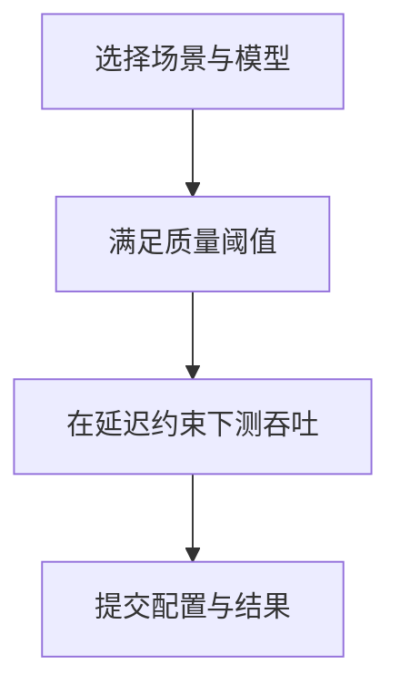

自己压测解决"我们系统有没有变好"；权威基准解决"在公认规则下能不能横向对话"。两者不能互相替代。这一节读懂 MLPerf Inference 一类基准到底比什么，以及 LLM 推理评测正在朝哪些方向演进，避免被榜单数字带偏业务决策。

<!-- more -->

## 📑 目录

- [1. 权威基准的价值与边界](#1-权威基准的价值与边界)
- [2. MLPerf Inference 速览](#2-mlperf-inference-速览)
- [3. 从传统 CNN 基准到 LLM 场景](#3-从传统-cnn-基准到-llm-场景)
- [4. LLM 评测趋势](#4-llm-评测趋势)
- [5. 如何正确使用外部榜单](#5-如何正确使用外部榜单)
- [6. 团队内部的"准权威"基线](#6-团队内部的准权威基线)
- [7. 小结：榜单在决策流中的位置](#7-小结榜单在决策流中的位置)
- [总结](#-总结)
- [自我检验清单](#-自我检验清单)
- [参考资料](#-参考资料)

---

## 1. 权威基准的价值与边界

| ✅ 权威基准擅长 | ❌ 权威基准不擅长 |
|---|---|
| 统一负载与指标定义 | 复刻你的业务 Prompt 分布 |
| 硬件/软件栈横向对比 | 直接给出你的容量规划数字 |
| 推动可复现与审报纪律 | 覆盖你的多租户/工具调用细节 |
| 发现明显回退与代差 | 代替质量评测（正确性/安全性） |

📌 **关键点**：榜单是**坐标系**，不是**施工图**。上线决策仍要以业务 SLO + 自有压测为准。

---

## 2. MLPerf Inference 速览

MLPerf Inference 由 MLCommons 组织，面向数据中心与边缘等场景，强调：

- **固定模型与质量阈值**（精度不能为了速度无底下探）
- **明确的延迟约束**（Server / Offline 等场景规则不同）
- **可提交、可复核的结果流程**

对 LLM / 生成式负载，近年提交持续增加：关注点从"每秒样本"扩展到受延迟约束的 Token 生成效率。读提交结果时务必看清：

- 场景（Server vs Offline 等）
- 模型与精度
- 硬件型号与规模
- 是否在延迟约束内统计



🔑 **核心概念**：MLPerf 比的是**约束下的有效吞吐**，不是无约束刷分。

---

## 3. 从传统 CNN 基准到 LLM 场景

传统图像分类基准假设：固定输入尺寸、单次前向、批次清晰。LLM 推理则不同：

- 输入/输出长度可变
- Prefill/Decode 两阶段异构
- 在线服务存在连续批处理与缓存
- 用户体验由 TTFT/TPOT 百分位定义

因此，把 CNN 时代的"只看 QPS"习惯直接搬到 LLM，会系统性误判。权威组织与产业界都在补齐生成式负载的规则与指标。

---

## 4. LLM 评测趋势

近年清晰可见的趋势：

1. **从平均延迟到百分位延迟**：P50 不够，P95/P99 进主指标
2. **从裸吞吐到 Goodput**：不满足 SLO 的产出不算产能
3. **负载形状敏感**：长上下文、系统提示复用、多模态被单独讨论
4. **质量与安全并行**：速度榜必须绑定质量阈值或独立质量集
5. **软件栈权重上升**：同一硬件上，引擎/调度/量化差异可超过硬件代差
6. **能效与成本**：tokens/s/W、$/1M tokens 进入采购对话

| 📊 旧习惯 | 新趋势 |
|---|---|
| 最大 tokens/s | SLO 内 Goodput |
| 单次离线批跑 | 在线到达过程 + 流式 |
| 只比硬件 | 硬件 × 引擎 × 精度 |
| 忽略缓存 | 前缀命中成为一等变量 |

💡 **提示**：如果你的流量前缀高度重复，却去对标"无缓存随机短请求"榜单，会低估自己也能达到的体验，或高估通用数字的可迁移性。

---

## 5. 如何正确使用外部榜单

读榜三问：

1. **场景是否同类？** 交互 Server vs 离线批处理
2. **约束是否同类？** 延迟阈值、质量阈值、精度
3. **栈是否可复现？** 引擎版本、并行度、是否投机解码

落地用法：

- 用榜单做**短名单**（哪些 GPU/引擎组合值得试）
- 用自有基准做**决选**（哪些组合满足我们的 SLO）
- 用成本模型做**采购**（$/有效 QPS，而非 $/峰值 tokens）

⚠️ **注意**：营销材料常摘"峰值吞吐"。缺延迟约束的峰值，对交互式产品参考价值有限。

---

## 6. 团队内部的"准权威"基线

建议维持一套变更极少的内部基线包：

- 冻结的模型版本 + 精度
- 冻结的三类负载（短交互 / 长上下文 / 高缓存命中）
- 冻结的指标与 SLO
- 每次引擎大版本发布必跑，结果入库

这套基线比外部榜更接近你们的"权威"。外部榜用来校准视野，内部基线用来守门。

内部基线包建议字段：

```text
baseline_id / date / engine_version / image_digest
hardware / model / precision / parallelism
workload_profile (short | long | cache-heavy)
TTFT_P50_P95 / TPOT_P50_P95 / tokens_per_s / error_rate
notes (known trade-offs)
```

每次大版本升级，先跑内部基线，再决定要不要去对外部榜上的新数字。

---

## 7. 小结：榜单在决策流中的位置

```text
外部榜单 → 产生候选硬件/软件组合
     ↓
内部基线 → 证明能否满足我们的 SLO
     ↓
成本模型 → 决定买多少、买哪一档
     ↓
门禁守护 → 防止合并后再退化
```

把榜单嵌进这条流，而不是让榜单替代这条流。

---

## 📝 总结

- 权威基准提供统一坐标系，不能替代业务压测。
- MLPerf Inference 强调质量阈值与延迟约束下的有效吞吐。
- LLM 负载的异构性要求新的指标与场景定义。
- 评测趋势走向百分位、Goodput、成本与软件栈可比性。
- 读榜先对场景与约束，再用短名单→自测→成本的落地路径。
- 团队应维护冻结的内部基线包作为真正门禁。
- 榜单只负责开阔候选集，验收永远回到自有 SLO。

## 🎯 自我检验清单

- 能说清权威基准与业务压测的分工
- 能解释 MLPerf 为何强调约束下吞吐
- 能指出 LLM 相对 CNN 基准的三个本质差异
- 能列举至少四条 LLM 评测趋势
- 能用"三问"批判性阅读一则营销榜单
- 能设计团队内部冻结基线包的内容清单

## 📚 参考资料

- [MLCommons — MLPerf Inference](https://mlcommons.org/benchmarks/inference/)
- [MLPerf Inference 最新结果与规则说明](https://mlcommons.org/)
- 产业界 LLM 推理基准博客与引擎官方 benchmarking 指南
