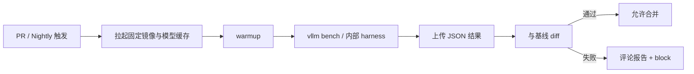

功能测试保证"能跑"，性能门禁保证"没有偷偷变慢"。推理栈变更频繁——内核、调度、默认 flag、依赖库——任何一次合并都可能让 TPOT P95 滑出 SLO。这一节把门禁规则、CI 集成和退化定位串成可执行流程。

<!-- more -->

## 📑 目录

- [1. 门禁要守住什么](#1-门禁要守住什么)
- [2. 规则设计：阈值、窗口与例外](#2-规则设计阈值窗口与例外)
- [3. CI 自动化集成](#3-ci-自动化集成)
- [4. 退化定位：git bisect + Nsight](#4-退化定位git-bisect--nsight)
- [5. 运营机制与防抖](#5-运营机制与防抖)
- [总结](#-总结)
- [自我检验清单](#-自我检验清单)
- [参考资料](#-参考资料)

---

## 1. 门禁要守住什么

最小门禁集（示例）：

| 指标 | 规则示例 | 动作 |
|---|---|---|
| TPOT P95 | 相对基线退化 > 5% | Block Merge |
| TTFT P95 | 相对基线退化 > 8% | Block Merge |
| 输出 Token 吞吐 | 同负载下降 > 5% | Block Merge |
| 错误率 / 超时率 | 任意显著上升 | Block Merge |
| 显存峰值 | 超预算或无法加载 | Block Merge |

📌 **关键点**：门禁比较的是**同负载、同硬件、同配置**下的相对变化，不是与历史营销峰值比。

---

## 2. 规则设计：阈值、窗口与例外

好规则具备：

1. **明确基线**：某 release tag 或 main 上每日产物
2. **噪声容忍**：重复跑 3 次取中位数，避免单次抖
3. **分层**：
   - PR 门禁：小模型 + 短负载（快）
   - Nightly：完整模型 + 饱和曲线（慢而全）
4. **例外流程**：预期内的权衡（如换更强量化）需文档说明并**更新基线**，而不是关灯

```text
if median(TPOT_P95_new) > baseline * 1.05:
    fail("performance regression")
```

💡 **提示**：对不同指标设不同阈值。TTFT 受排队与缓存影响更大，阈值可略宽；TPOT 更稳，可更严。

---

## 3. CI 自动化集成

推荐流水线：



落地要点：

- **硬件标签**：Runner 固定 GPU 型号，避免 A/B 机器混跑
- **镜像 digest 钉死**：CUDA / 驱动尽量同代
- **结果制品化**：每次跑的 config + metrics 入库
- **PR 评论**：自动贴关键指标表，减少口头争论
- **超时与重试**：基础设施抖动不直接宣判代码有罪——先重试再 fail

⚠️ **注意**：共享 GPU CI 池若被其它任务污染，门禁会假阳性。隔离设备或独占时间窗是值得付的成本。

---

## 4. 退化定位：git bisect + Nsight

当 Nightly 或发布候选失败：

### 4.1 用 git bisect 找首个坏提交

```bash
git bisect start
git bisect bad HEAD
git bisect good <known-good-tag>

# bisect run 可挂脚本：构建 → 压测 → 返回 0/1
git bisect run ./scripts/perf_bisect.sh
```

`perf_bisect.sh` 应：

- 失败返回非 0
- 基础设施错误返回 125（跳过）
- 尽量只用快速门禁负载，缩短二分时间

### 4.2 用 Nsight 对比好坏提交

锁定 bad commit 后：

1. 在 good / bad 两个 commit 上用同一 bench 命令抓 **Nsight Systems**
2. 对比时间线：新增同步？通信变长？Kernel 变了？图捕获失败？
3. 对锁定的热点 Kernel 再跑 **Nsight Compute** diff
4. 回到代码：调度改动、默认 flag、依赖升级、精度路径切换

🔑 **核心概念**：**bisect 负责"是哪次改动"，Nsight 负责"改动为何变慢"**。两者缺一都会在猜测中浪费时间。

---

## 5. 运营机制与防抖

| 机制 | 目的 |
|---|---|
| 基线定期重打 | 跟随合理优化上移，避免旧基线过松/过严 |
| 变更分类标签 | `perf-sensitive` PR 强制跑更全套件 |
| 性能业主制 | 模块有人响应回归，不让门禁变红灯摆设 |
| 假阳性复盘 | 统计噪声来源，收紧环境而非放松阈值 |
| 与质量门禁并行 | 禁止靠降质刷性能；量化变更走独立批准 |

动手实验建议：

1. 用 `vllm bench serve` 打出当前完整报告作基线
2. 人为制造退化（如关闭 CUDA Graph / 改小 batch 相关配置）
3. 看门禁是否捕获
4. 用 nsys 对比两份时间线，写清根因一句话

### 5.1 报告模板（给 PR 评论）

```text
Workload: mix-chat-1k/200 @ 8 QPS
TTFT P95: 620ms → 710ms (+14.5%)  FAIL (budget 8%)
TPOT P95: 28ms → 29ms (+3.6%)     PASS (budget 5%)
Tok/s:    2100 → 2050 (-2.4%)     PASS
Errors:   0 → 0                   PASS
Verdict: BLOCK — investigate Prefill/queue path
```

有了固定模板，门禁从"红灯恐吓"变成"可执行信息"。

当门禁失败但 bisect 指向"依赖升级"而非业务代码时，同样按回归处理：钉死版本、补兼容层，或显式更新基线并记录风险——**不要因为是传递依赖就放行**。

---

## 📝 总结

- 性能门禁守护 TTFT/TPOT/吞吐/错误率等相对基线的退化。
- 规则需要中位数防抖、PR/Nightly 分层与合法更新基线的例外流程。
- CI 要固定硬件与镜像，并把结果制品化、可评论。
- git bisect 定位坏提交，Nsight 解释变慢机制。
- 运营上要有业主、复盘与质量并行，防止门禁形同虚设。
- PR 评论用统一报告模板，减少口头拉扯。

## 🎯 自我检验清单

- 能写出至少三条可执行的门禁规则
- 能说明为何要用中位数而非单次结果
- 能画出 PR/Nightly 分层 CI 流程
- 能解释 bisect 脚本返回 0/1/125 的含义
- 能描述 good/bad 提交的 Nsight 对比步骤
- 能提出两条降低假阳性的环境措施

## 📚 参考资料

- [git-bisect 官方文档](https://git-scm.com/docs/git-bisect)
- [vLLM Benchmarking](https://docs.vllm.ai/en/latest/benchmarking/)
- [Nsight Systems User Guide](https://docs.nvidia.com/nsight-systems/)
