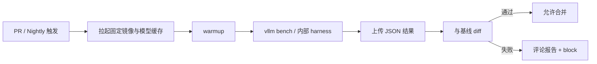

指标、压测与分析工具齐了（[9.1](./9.1-推理指标体系.md)–[9.3](./9.3-性能分析工具.md)），还缺最后一环：**没有门禁，回归会在合并洪流里 silently 溜走**。功能测试保证「能跑」，性能门禁保证「没有偷偷变慢」。这一节把规则、CI、定位串起来，并正面回答两个运营问题：**阈值怎么定**，以及 **假阳性 / 假阴性如何权衡**——阈值不是拍脑袋的 5%。

<!-- more -->

## 📑 目录

- [1. 门禁要守住什么](#1-门禁要守住什么)
- [2. 阈值怎么定](#2-阈值怎么定)
- [3. 假阳性 vs 假阴性](#3-假阳性-vs-假阴性)
- [4. CI 自动化集成](#4-ci-自动化集成)
- [5. 退化定位：git bisect + Nsight](#5-退化定位git-bisect--nsight)
- [6. 运营机制与报告模板](#6-运营机制与报告模板)
- [7. 代价与权衡](#7-代价与权衡)
- [总结](#-总结)
- [自我检验清单](#-自我检验清单)
- [参考资料](#-参考资料)

---

## 1. 门禁要守住什么

最小门禁集（示例口径，需按噪声标定后落库）：

| 指标 | 规则示例 | 动作 |
|---|---|---|
| TPOT P95 | 相对基线退化 > 标定阈值 | Block Merge |
| TTFT P95 | 相对基线退化 > 标定阈值（通常略宽） | Block Merge |
| 输出 Token 吞吐 | 同负载下降超过标定阈值 | Block Merge |
| 错误率 / 超时率 | 任意显著上升 | Block Merge |
| 显存峰值 | 超预算或无法加载 | Block Merge |

📌 **关键点**：门禁比较的是**同负载、同硬件、同配置**下的相对变化，不是与历史营销峰值比，也不是与 [9.4](./9.4-权威基准.md) 榜单绝对值比。

---

## 2. 阈值怎么定

好阈值来自**噪声测量**，不是来自圆整百分比。

### 2.1 标定步骤

1. 在固定 Runner 上，对同一 commit 重复跑门禁负载 $N$ 次（如 $N=10\sim20$）；
2. 对每个指标算变异：标准差 $\sigma$ 或稳定的分位差（如 run-to-run P95 的离散）；
3. 设阈值带宽约为 $k\cdot\sigma$（常见 $k=2\sim3$），再加一点工程余量；
4. **分指标**：TPOT 通常更稳 → 可更严；TTFT 受排队/缓存影响更大 → 可略宽；
5. 分层负载：PR 用短负载快门禁；Nightly 用完整饱和点。

教学示意（**非实测**；单位 ms）：同 commit 重复 10 次，TPOT P95 的样本标准差 $\sigma\approx 0.6\,\mathrm{ms}$，基线中位数 $28.0\,\mathrm{ms}$。若取 $k=3$：

\[
\text{阈值} \approx 3\times 0.6 / 28.0 \approx 6.4\%
\]

取整为「相对基线 +7% 失败」比拍一个「+5%」更诚实。若某共享 GPU 池 $\sigma$ 大到 5%，先治环境，而不是把阈值放到 20% 假装稳定。

### 2.2 规则形态

```text
metric = median(runs)   # 或剔除异常后的中位数
if metric > baseline * (1 + threshold):
    fail("performance regression")
```

好规则还具备：

- **明确基线**：某 release tag 或 main 上每日产物；
- **噪声容忍**：重复跑取中位数，避免单次抖；
- **例外流程**：预期内权衡（更强量化等）需文档说明并**更新基线**，而不是关灯。

💡 **提示**：阈值应随 Runner 隔离质量重标定。换 GPU 型号或驱动大版本后，旧阈值可能整体失效——先重打基线与 $\sigma$，再谈「谁回归了」。

---

## 3. 假阳性 vs 假阴性

| 类型 | 含义 | 典型后果 |
|---|---|---|
| **假阳性** | 代码没变慢，门禁红了 | 开发空转、绕过门禁、信任崩塌 |
| **假阴性** | 真变慢了，门禁绿了 | 静默退化，直到用户或大促暴露 |

权衡没有免费午餐：

| 调参方向 | 假阳性 | 假阴性 | 适用 |
|---|---|---|---|
| 阈值收紧 / 单次即判 | ↑ | ↓ | 独占稳定机器、核心路径 |
| 阈值放宽 / 多次中位数 | ↓ | ↑ | 噪声大的共享池（权宜） |
| 先重试再 fail | ↓ | 略↑ | 基础设施抖动常见时 |
| PR 宽、Nightly 严 | PR 吵闹↓ | 日级才抓到部分问题 | 人力与机器有限时 |

取舍句：**把阈值从 5% 放到 15%「减少打扰」，本质是用更高假阴性换安静**——若 $\sigma$ 本身只有 1%，这是在放弃门禁，不是在「务实」。正确顺序是：**先降环境噪声，再定阈值**。

降低假阳性的优先手段（按性价比）：

1. 独占或隔离 GPU 时间窗；
2. 镜像 digest / 驱动钉死；
3. 中位数 + 有限重试；
4. 预热与正式窗分离（[9.2](./9.2-压测工具.md)）；
5. 最后才考虑放宽阈值。

降低假阴性的手段：

1. Nightly 全量饱和曲线，不只跑一个甜点 QPS；
2. 对 `perf-sensitive` PR 强制更全套件；
3. 错误率与显存纳入硬门禁，避免「延迟没动但靠降质/OOM 边缘」；
4. 与质量门禁并行，禁止靠降质刷性能。

---

## 4. CI 自动化集成

推荐流水线：



落地要点：

- **硬件标签**：Runner 固定 GPU 型号，避免 A/B 机器混跑；
- **镜像 digest 钉死**：CUDA / 驱动尽量同代；
- **结果制品化**：每次跑的 config + metrics 入库；
- **PR 评论**：自动贴关键指标表；
- **超时与重试**：基础设施抖动不直接宣判代码有罪——先重试再 fail。

⚠️ **注意**：共享 GPU CI 池若被其它任务污染，门禁会假阳性。隔离设备或独占时间窗是值得付的成本；用放宽阈值掩盖污染，会系统性提高假阴性。

---

## 5. 退化定位：git bisect + Nsight

当 Nightly 或发布候选失败：

### 5.1 用 git bisect 找首个坏提交

```bash
git bisect start
git bisect bad HEAD
git bisect good <known-good-tag>

# bisect run 可挂脚本：构建 → 压测 → 返回 0/1
git bisect run ./scripts/perf_bisect.sh
```

`perf_bisect.sh` 应：

- 失败返回非 0；
- 基础设施错误返回 125（跳过）；
- 尽量只用快速门禁负载，缩短二分时间。

### 5.2 用 Nsight 对比好坏提交

锁定 bad commit 后：

1. 在 good / bad 两个 commit 上用同一 bench 命令抓 **Nsight Systems**（[9.3](./9.3-性能分析工具.md)）；
2. 对比时间线：新增同步？通信变长？Kernel 变了？图捕获失败？
3. 对锁定的热点 Kernel 再跑 **Nsight Compute** diff；
4. 回到代码：调度改动、默认 flag、依赖升级、精度路径切换。

🔑 **核心概念**：**bisect 负责「是哪次改动」，Nsight 负责「改动为何变慢」**。两者缺一都会在猜测中浪费时间。

当门禁失败但 bisect 指向「依赖升级」而非业务代码时，同样按回归处理：钉死版本、补兼容层，或显式更新基线并记录风险——**不要因为是传递依赖就放行**。

---

## 6. 运营机制与报告模板

| 机制 | 目的 |
|---|---|
| 基线定期重打 | 跟随合理优化上移，避免旧基线过松/过严 |
| 变更分类标签 | `perf-sensitive` PR 强制跑更全套件 |
| 性能业主制 | 有人响应回归，不让红灯变摆设 |
| 假阳性复盘 | 统计噪声来源，收紧环境而非放松阈值 |
| 与质量门禁并行 | 禁止靠降质刷性能 |

报告模板（PR 评论）：

```text
Workload: mix-chat-1k/200 @ 8 QPS
TTFT P95: 620ms → 710ms (+14.5%)  FAIL (budget 8%)
TPOT P95: 28ms → 29ms (+3.6%)     PASS (budget 7%)
Tok/s:    2100 → 2050 (-2.4%)     PASS
Errors:   0 → 0                   PASS
Verdict: BLOCK — investigate Prefill/queue path
Noise note: threshold from σ-calib on runner gpu-h100-01
```

动手实验建议：

1. 用 `vllm bench serve` 打出当前完整报告作基线；
2. 人为制造退化（如关闭 CUDA Graph / 改小相关配置）；
3. 看门禁是否捕获（真阳性）；
4. 同 commit 连跑多次，估计假阳性率；
5. 用 nsys 对比两份时间线，写清根因一句话。

---

## 7. 代价与权衡

| 选择 | 收益 | 代价 / 不适用 |
|---|---|---|
| 严阈值 + 独占 Runner | 假阴性低 | 机器成本高 |
| 宽阈值 + 共享池 | 红灯少 | 静默退化风险高 |
| PR 全量饱和曲线 | 抓得早 | PR 周期变长 |
| PR 快测 + Nightly 全量 | 节奏可接受 | 部分问题隔日才现 |
| 失败即人工「先合并」 | 短期不堵车 | 门禁名存实亡 |

适用：已有可复现压测（[9.2](./9.2-压测工具.md)）与固定硬件标签。  
若环境噪声未治理，先不要指望「再调一个魔法百分比」能同时压住假阳性与假阴性。

---

## 📝 总结

- 性能门禁守护同负载下 TTFT/TPOT/吞吐/错误率相对基线的退化。
- **阈值由重复跑的噪声 $\sigma$ 标定**，并分指标、分 PR/Nightly；忌拍脑袋。
- 假阳性靠隔离环境与中位数/重试治理；假阴性靠全量 Nightly 与敏感 PR 加测——放宽阈值是最后手段。
- CI 要固定硬件与镜像，结果制品化、可评论。
- git bisect 定位坏提交，Nsight 解释变慢机制。
- 运营上要有业主、复盘与质量并行；传递依赖回归不得豁免。

## 🎯 自我检验清单

- 能描述从重复跑到得出阈值的标定步骤，并口述一笔 $\sigma$ 示意账
- 能说明假阳性与假阴性各自的业务代价，以及为何应先降噪声再调阈值
- 能写出至少三条可执行的门禁规则（含动作）
- 能画出 PR/Nightly 分层 CI 流程
- 能解释 bisect 脚本返回 0/1/125 的含义
- 能描述 good/bad 提交的 Nsight 对比步骤，并提出两条降假阳性的环境措施

## 📚 参考资料

- [git-bisect 官方文档](https://git-scm.com/docs/git-bisect)
- [vLLM Benchmarking](https://docs.vllm.ai/en/latest/benchmarking/)
- [Nsight Systems User Guide](https://docs.nvidia.com/nsight-systems/)
- [本模块 9.1 推理指标体系](./9.1-推理指标体系.md)
- [本模块 9.2 压测工具](./9.2-压测工具.md)
- [本模块 9.3 性能分析工具](./9.3-性能分析工具.md)
- [本模块 9.4 权威基准](./9.4-权威基准.md)
