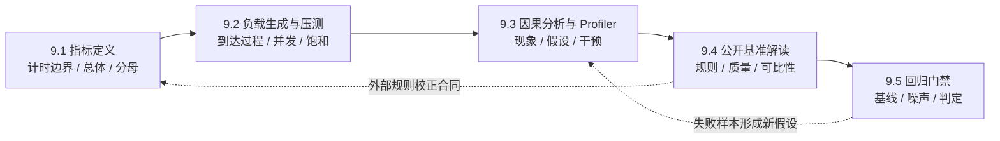

第 1 章给出了 TTFT、TPOT、吞吐与 Goodput 的名字，第 3 章强调框架比较必须固定 Workload 与 SLO，第 7 章又用端到端 Goodput 判断架构是否成立。本章把这些要求收束为一份可审查的**测量合同**：先说清测量对象和成立条件，再讨论数字。
它是 9.1—9.5 的理论设计合同，面向第一次做 AI Infra 性能实验的读者；重点是怎样提出可证伪的问题、获得可复现证据并限制结论边界，而不是记住某个工具的操作方式。
<!-- more -->

## 本章导航
- [1. 本章定位](#1-本章定位)
- [2. Benchmark 合同](#2-benchmark-合同)
- [3. 指标层次](#3-指标层次)
- [4. 一张知识图](#4-一张知识图)
- [5. 贯穿五节的基准合同](#5-贯穿五节的基准合同)
- [6. 测量纪律](#6-测量纪律)
- [7. 七个持续追问](#7-七个持续追问)
- [8. 五节边界与承诺](#8-五节边界与承诺)
- [9. 学完应具备的能力](#9-学完应具备的能力)
- [总结](#总结)
- [自我检验](#自我检验)
- [标准资料](#标准资料)

---

## 1. 本章定位
性能不是软件脱离条件后自带的常数。同一服务在短输入、低并发时可以有很低的 TTFT，在长输入、突发到达时却可能排队失稳；更高的 token/s 也可能来自输出更长、质量下降或超时请求被排除。
所以 Benchmark 的产物不是“最快值”，而是可以复核的三元组：**条件、结果、解释**。
> 可信结论必须回答：在什么合同下，哪个系统对哪类请求，在何种质量与 SLO 约束内，比基线改变了多少；不确定性有多大？
本章从用户请求逐层走到系统资源，再从一次实验走到公开比较和持续门禁。局部利用率用于解释机制，端到端服务结果才决定优化是否兑现。

## 2. Benchmark 合同
一次结果只在合同 \(C\) 内成立：
$$
R\mid C,\qquad C=(W,S,Q,M)
$$
1. **Workload \(W\)**：输入与输出长度的联合分布、请求内容、到达过程、offered load、并发上限、流式方式和缓存温度。
2. **System \(S\)**：模型与权重版本、Tokenizer、精度、引擎与配置、硬件数量和拓扑、软件栈、功耗与时钟策略。
3. **Quality / SLO \(Q\)**：输出质量底线、协议正确性、超时规则，以及 TTFT、TPOT、E2E 等服务承诺。
4. **Measurement \(M\)**：计时边界、统计总体、分母、预热、随机化、重复次数、样本量、分位数算法和置信区间。
缺少 \(W\)，吞吐不知道服务了什么；缺少 \(S\)，结果无法复现；缺少 \(Q\)，系统可以靠少做或做错来变快；缺少 \(M\)，差异可能只是噪声或统计口径。
两个结果只有在合同相同，或差异被明确声明为实验自变量时才可比较。一次改变多个条件只能证明“方案 A 与方案 B 不同”，不能把收益归因给其中一个参数。

## 3. 指标层次
### 3.1 请求层：用户等了多久
设客户端实际发出请求的时刻为 \(t_0\)，依次收到 \(N\) 个可消费输出 token 的时刻为 \(t_1,\ldots,t_N\)，协议确认响应完成的时刻为 \(t_{done}\)。在这条客户端端到端时间线上：
$$
\mathrm{TTFT}=t_1-t_0,\quad
\mathrm{ITL}_i=t_i-t_{i-1},\quad
\mathrm{TPOT}=\frac{t_N-t_1}{N-1},\quad
\mathrm{E2E}=t_{done}-t_0
$$
其中 TPOT 只对 \(N\ge2\) 定义。首 token、末 token 与协议完成可能是三个不同边界；如果改用服务端接收时刻或最后一个字节到达时刻，必须另起指标名，不能沿用同一标签。

### 3.2 系统层：单位时间完成了多少
开环 Poisson 的目标负载是配置的名义强度；单次 Manifest 的计划实现率和实际到达被测边界的 offered load 还要分别记录，三者都不是系统完成速度：
$$
\lambda_{\mathrm{target}}:=\text{configured intensity},\qquad
\lambda_{\mathrm{scheduled}}=\frac{N_{\mathrm{scheduled}}}{T_{\mathrm{arrival}}},\qquad
\lambda_{\mathrm{offered}}=\frac{N_{\mathrm{arrived}}}{T_{\mathrm{arrival}}}
$$
Poisson 的 \(N_{\mathrm{scheduled}}\) 会随机波动；客户端忠实度应比较 scheduled 与 offered 及逐请求迟发，不能把该波动误判为发压失败。
请求吞吐与输出 token 吞吐则可写为：
$$
X_{\mathrm{req}}=\frac{N_{\mathrm{success}}}{T_{\mathrm{obs}}},\qquad
X_{\mathrm{out}}=\frac{\sum_{r\in\mathrm{success}}N_{\mathrm{out},r}}{T_{\mathrm{obs}}}
$$
\(T_{\mathrm{obs}}\) 的起止、压测停止后的 drain、未完成样本和超时截止点都属于合同。不能把短时间灌入后排队很久才完成的请求，仍除以那段很短的灌入时间来宣称吞吐。

### 3.3 服务层：按约定完成了多少
数据集级质量先形成全局准入门：candidate 任务分数下降不超过 0.5 个百分点且协议有效率不低于 99.9%。
通过质量门后，Goodput 把“做完”提升为“按时限做完”：
$$
\mathrm{Goodput}=
\frac{\#\{r:\mathrm{success}\land N_r\ge1\land TTFT\le S_T
\land E2E\le S_E\land(N_r=1\lor TPOT\le S_P)\}}{T_{\mathrm{obs}}}
$$
\(N_r=1\) 时 TPOT 不适用，\(N_r=0\) 时没有 TTFT、不能进入分子。
质量门失败应标为 `QUALITY_FAIL`，不能把 Goodput 置零后继续排名；拒绝、错误、取消和超时也不能从总体中消失。

### 3.4 资源层：系统为什么得到这个结果
GPU 活跃率、算力与显存带宽、HBM 占用、CPU 时间、网络与通信、功耗等是解释变量，不是用户结果。高利用率可能意味着有效工作，也可能意味着重算、排队或低效 Kernel；资源指标必须回接 TTFT、ITL、吞吐和 Goodput。

### 3.5 统计层：总体怎样分布
均值描述总预算，P50 描述典型请求，P95/P99 描述尾部；它们互补而不互相替代。P99 是有限样本对总体分位数的估计，不是“99% 永远不会更慢”的保证，必须同时给出样本量、算法和不确定性。
聚合前要声明样本单位：每请求、每 token 间隔和每轮实验会得到不同分布。输入长度、输出长度与 offered load 常同时影响延迟，应报告条件分布或联合分布，而不只给一个混合总体。
边际的 TTFT P99 与 TPOT P99 可能来自不同请求，不能推出 99% 的请求同时达标。联合 SLO 应在同一请求上判定；指标相关只能生成假设，不能单独证明因果。

## 4. 一张知识图

实线是证据逐步加固的顺序：没有指标定义，负载数据没有语义；没有有效负载，Profiler 只是在解释一次偶然运行；没有因果证据，公开排名和回归告警都容易被过度解读。

## 5. 贯穿五节的基准合同
除非某节明确把一个条件设为敏感性分析轴，9.1—9.5 的示例、推导和结论统一使用下面的教学合同；它用于练习方法，不预设任何性能结果。
- **问题**：比较 baseline 与 candidate 的 Goodput—offered-load 曲线，分别定位聚合 SLO 边界与网格 Goodput 峰值，而不是把两者混成一个“拐点”。
- **模型 \(M_0\)**：同一份约 8B 指令模型的权重、Tokenizer、Chat Template 与解码配置，均以内容摘要固定；默认 BF16、TP=1。
- **硬件 \(H_0\)**：同一台专用单机、同一张 80 GiB GPU；CPU、内存、GPU SKU、固件、驱动、运行时、功耗和时钟策略写入环境清单。
- **长度联合分布**：按固定种子抽样，60% 为 \((512,128)\)、30% 为 \((2048,256)\)、10% 为 \((8192,512)\)，分别表示输入 token 与请求输出 token；实际输出长度另行记录。
- **到达过程**：稳态主实验使用开环 Poisson 到达；baseline pilot 先确定参考率 \(\lambda_{ref}\)，随后冻结 \(0.25,0.5,0.75,1.0,1.25\times\lambda_{ref}\) 五个名义强度和计划 Manifest，candidate 不得重新选点。
- **并发语义**：服务端在途请求上限固定为 256；超过上限的到达仍计入 offered load，并记录为拒绝或超时，客户端不得因服务变慢而悄悄降低发送率。
- **缓存温度**：运行时编译、内存池与图执行预热到稳态；主结果使用冷 Prefix Cache 和唯一前缀，另设固定 80% 命中率的热缓存实验，两组不混合聚合。
- **质量约束**：冻结任务集、评分器与随机种子；candidate 的任务分数不得比 baseline 下降超过 0.5 个百分点，协议有效率不低于 99.9%；这是数据集级性能准入门，不是请求级 `quality_ok`。
- **请求级 SLO**：\(TTFT\le500\,ms\)、\(TPOT\le40\,ms\)、\(E2E\le25\,s\)，硬超时为 30 s；\(N=1\) 时 TPOT 不适用，\(N=0\) 不进入 Goodput。
- **聚合 SLO**：每个负载点要求 \(A_{joint}\ge95\%\)；相邻点从达标变为不达标时形成观测 SLO 边界区间，统计门禁仍使用运行级置信规则。
- **统计协议**：每个负载点至少五次独立重复；在看到 candidate 前声明停止规则，以运行级配对差值和 95% 置信区间报告效应，原始请求事件全部保留。
公开基准若不能采用 \(M_0/H_0\)，就建立一份新的完整合同并只在其内部解释；不得把不同合同中的绝对数字拼成排行榜。

## 6. 测量纪律
- **可复现性**：保存不可变的模型、代码、镜像、数据摘要和完整配置，也保存原始事件；只留聚合结果无法重算分位数或解释失败。
- **随机性**：种子让一次抽样可重放，却不会消除总体随机性。请求顺序、到达间隔和 baseline/candidate 运行顺序应随机化，并在同一环境块内配对。
- **预热**：冷启动与稳态是两个问题。主实验先达到预声明稳态，权重加载、编译、图捕获和缓存建立的成本单独测，不能挑选“看起来稳定”的起点。
- **样本量**：先按希望识别的最小实际差异和尾部分位数精度制定停止规则；样本不足时结论应为“不确定”，而不是把 P99 当成最大值后强行排序。
- **置信区间**：同时报告效应大小与 95% 区间。连续请求存在自相关，独立实验运行才是推断单位；把同一轮的一万条请求当一万次独立重复会制造虚假精度。
- **Observer effect**：Trace、采样和同步会改变被测时间线。Profiler 用于诊断的运行应与无侵入基线分开，并量化启用观测后的开销。
- **客户端瓶颈**：校验计划与实际到达时间、客户端 CPU/网络余量及连接错误。客户端发不动会让 offered load 下降，闭环背压还可能把慢系统伪装成稳定系统。
环境温度、频率降档、共享任务、后台流量和运行顺序漂移共同构成 noise budget。先量化噪声，再决定多少差异值得触发结论或门禁。

## 7. 七个持续追问
阅读 9.1—9.5 的任何数字，都先问：
1. **测了谁**：客户端 E2E、服务端处理、某个阶段，还是单个 Kernel？
2. **分母是什么**：请求、输出 token、总 token、GPU 数、功耗，还是墙钟时间？
3. **offered load 是多少**：计划到达与实际到达是否一致，开环还是闭环，是否已经饱和？
4. **失败去了哪里**：成功、拒绝、错误、取消、超时和未完成请求是否都在总体内？
5. **环境是否同一**：模型、质量、硬件、软件栈、缓存温度、功耗和时钟是否对齐？
6. **噪声有多大**：预热、随机性、样本量、重复和置信区间能否区分信号与波动？
7. **因果还是相关**：是否只有一个受控变化，是否存在混杂变量与 observer effect，反事实证据是什么？
这七问不是报告末尾的检查清单，而是实验设计、采集、分析和发布各阶段共同的评审语言。

## 8. 五节边界与承诺
- [**9.1 推理指标体系：别让一个平均值骗过你**](/AIInfraGuide/inference/模块四-推理优化/第9章-性能分析与benchmark/91-推理指标体系)：定义请求时间线、吞吐分母、Goodput、样本单位、分位数与联合分布；不讨论怎样制造压力。
- [**9.2 压测工具：从能跑到测得可信**](/AIInfraGuide/inference/模块四-推理优化/第9章-性能分析与benchmark/92-压测工具)：研究开环/闭环、到达过程、长度与缓存分布、coordinated omission、饱和曲线和客户端有效性；理论主线不依赖某条命令。
- [**9.3 性能分析工具：从慢请求走到 GPU 时间线**](/AIInfraGuide/inference/模块四-推理优化/第9章-性能分析与benchmark/93-性能分析工具)：从服务症状提出可证伪假设，用对照、干预和多层时间线缩小因果范围，并核算观测开销；不把相关轨迹直接命名为根因。
- [**9.4 权威基准：怎样做一场公平比较**](/AIInfraGuide/inference/模块四-推理优化/第9章-性能分析与benchmark/94-权威基准)：审查规则、系统边界、负载、质量、统计和披露等级，解释公开结果为何可比或不可比；不复述榜单名次。
- [**9.5 性能回归门禁：把快变成可持续的工程能力**](/AIInfraGuide/inference/模块四-推理优化/第9章-性能分析与benchmark/95-性能回归门禁)：把稳定合同、基线、noise budget、实际阈值与统计判定固化为治理流程；不把一次波动或单指标变化机械判成回归。
五节共同维护同一份合同和原始证据链。本总览只给出理论边界，不展开工具操作或自动化实现。

## 9. 学完应具备的能力
- 能把“系统更快”改写成带 Workload、System、Quality/SLO 与 Measurement 的可证伪命题；
- 能沿请求时间线定义 TTFT、ITL、TPOT 和 E2E，并为吞吐与 Goodput 说明分子、分母和失败语义；
- 能设计不会因客户端背压、缓存温度或长度构成变化而失真的 offered-load 实验；
- 能用均值、分位数、条件/联合分布、样本量和置信区间表达结果边界；
- 能从相关现象形成因果假设，并用对照、干预和无观测基线逐步验证；
- 能审计公开 Benchmark 的可比性，并把可信场景转化为抗噪声的回归门禁。

## 总结
性能工程的核心不是获得更多数字，而是让每个数字都有明确对象、单位、分母、条件和不确定性。Workload、System、Quality/SLO 与 Measurement 四部分缺一不可。
9.1—9.5 将依次完成“定义什么算快、施加什么压力、怎样解释原因、怎样阅读外部证据、怎样长期守住结果”的闭环；任何结论都只在声明的合同内成立。

## 自我检验
- 为什么输出 token 吞吐更高，仍可能伴随 Goodput 下降？
- TPOT 均值与 ITL P99 分别会隐藏什么信息？
- 为什么相同平均 RPS 的开环 Poisson 流量和固定并发不是同一个实验？
- 同一负载点中，计划发送、实际到达、成功完成和按 SLO 完成应怎样区分？
- 为什么“GPU 利用率与 TTFT 同时升高”还不是因果结论？
- P99 样本量很小或请求存在自相关时，置信区间应以什么为推断单位？
- Profiler 中出现新的热点前，为什么必须先比较无 Profiler 基线？
- 两份公开结果模型名称相同，还要对齐哪些合同字段才可横向比较？

## 标准资料
- [MLPerf Inference 文档](https://docs.mlcommons.org/inference/)
- [MLPerf Inference Policies](https://github.com/mlcommons/inference_policies)
- [NIST/SEMATECH e-Handbook of Statistical Methods](https://www.itl.nist.gov/div898/handbook/)
- [NIST Technical Note 1297：测量不确定性表达指南](https://www.nist.gov/pml/nist-technical-note-1297)
- [RFC 2330: Framework for IP Performance Metrics](https://www.rfc-editor.org/rfc/rfc2330)
- [DistServe：以 Goodput 为目标的 LLM Serving](https://arxiv.org/abs/2401.09670)
> 标准与论文提供的是定义和审查框架，不替代目标模型、硬件、流量与 SLO 下的实测。
